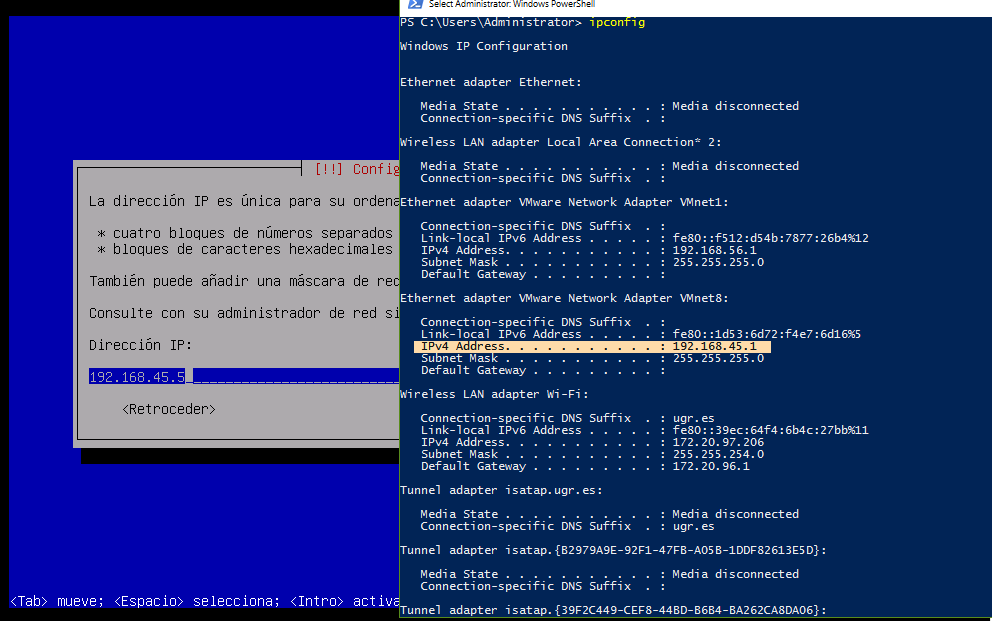
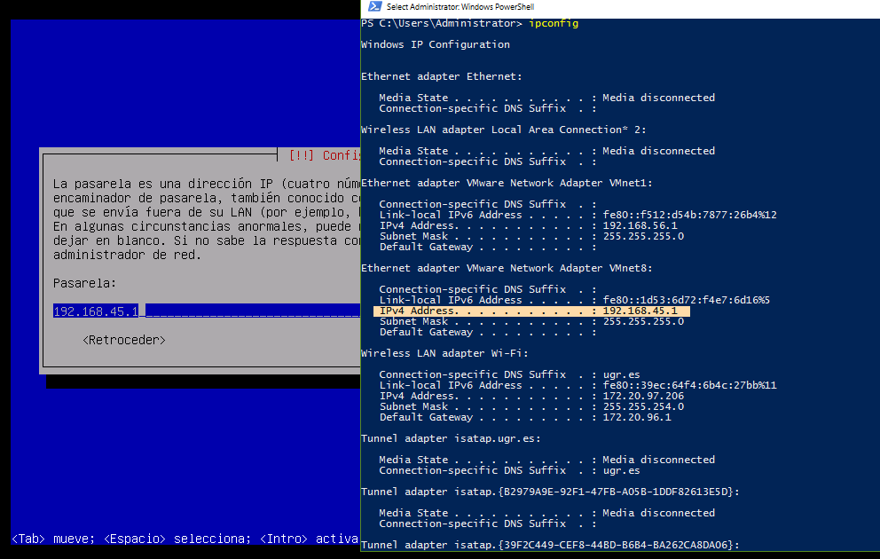
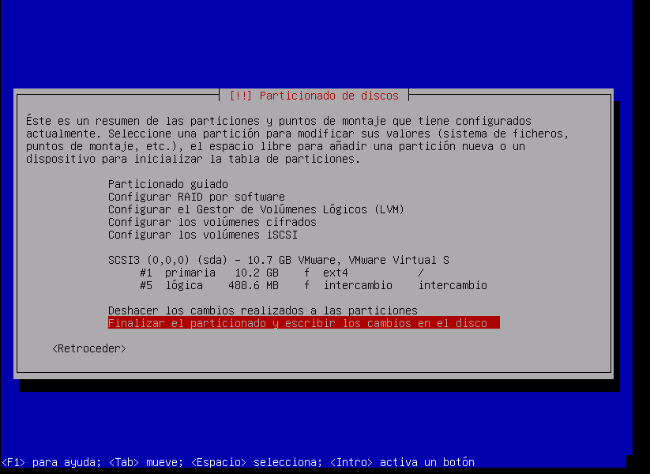
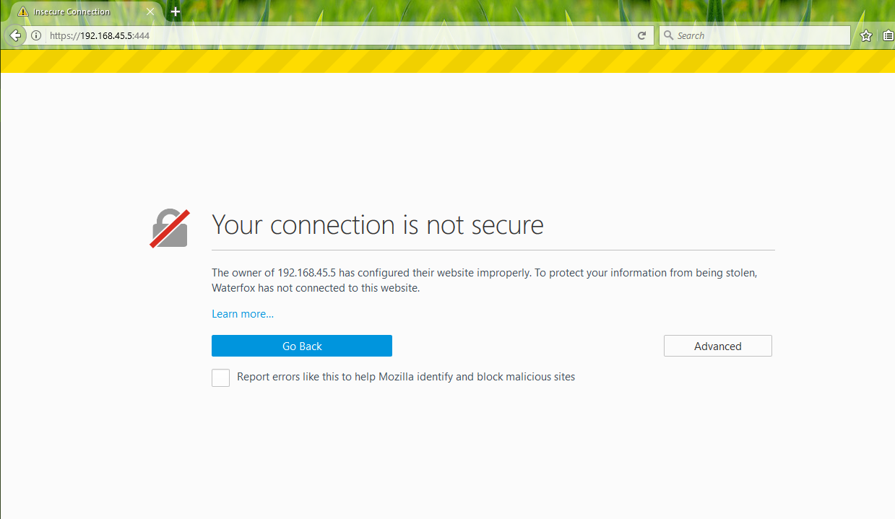
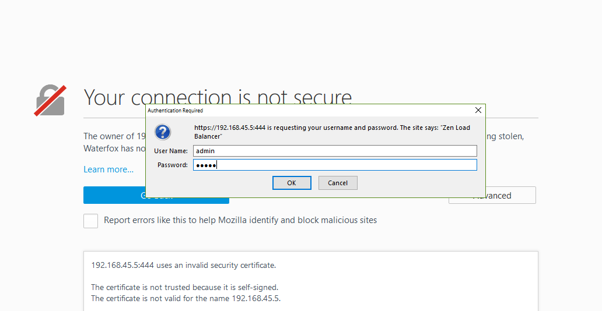
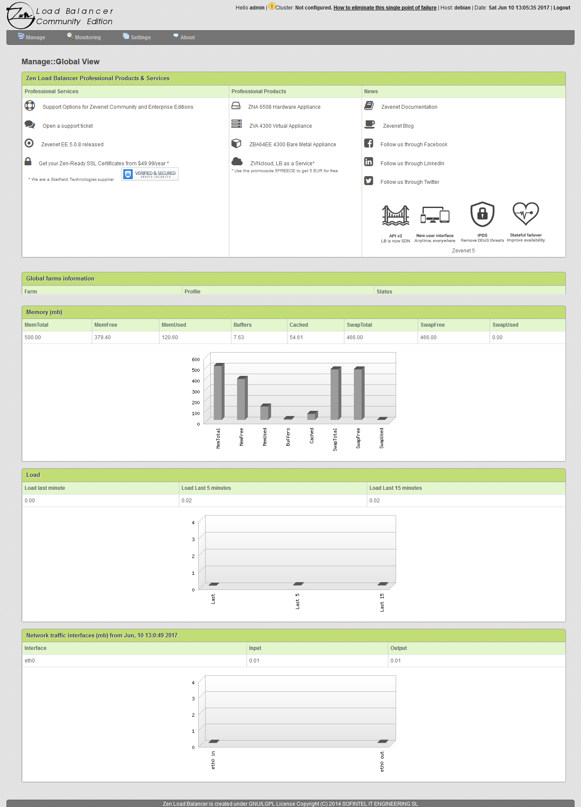
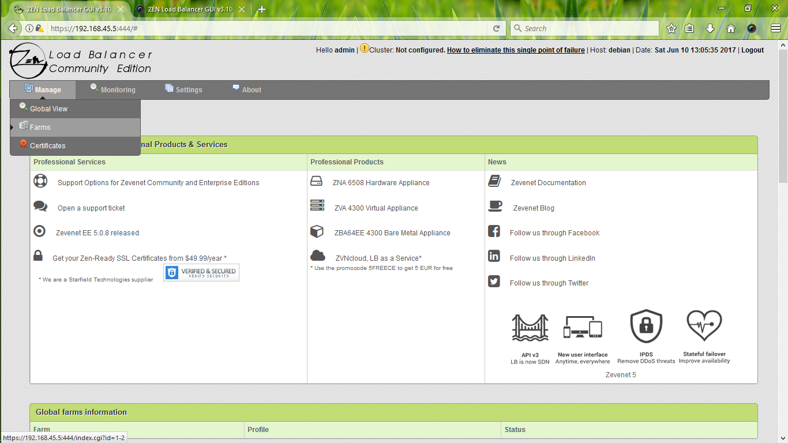
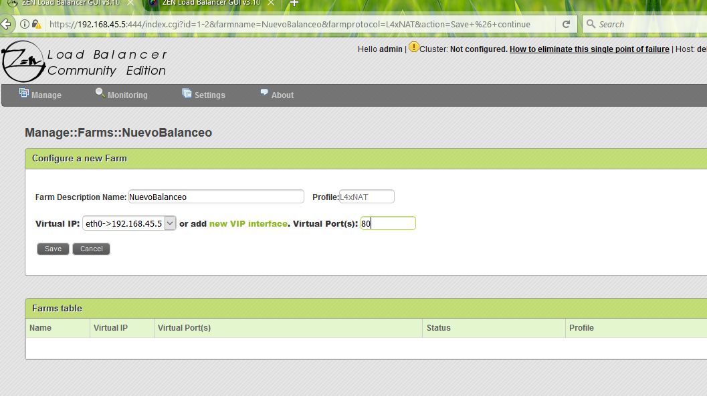
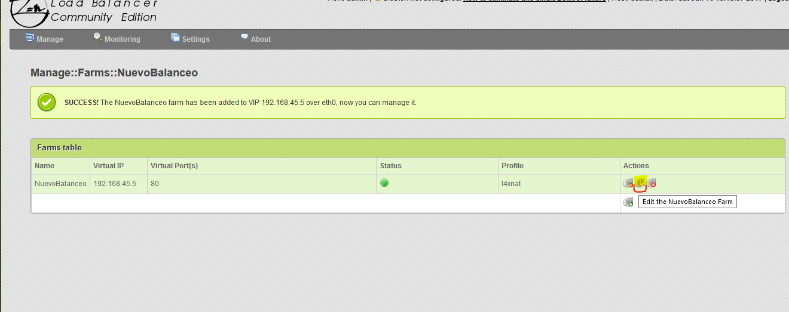
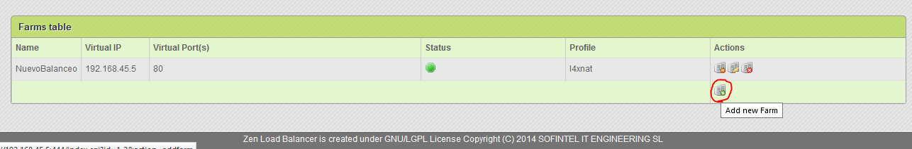

# Ejercicio T4.4:
## Instala y configura en una máquina virtual el balanceador
ZenLoadBalancer. 

Para instalar este balanceador uso los pasos marcados [1]:

1.- Descargamos el balanceador de https://sourceforge.net/projects/zenloadbalancer/

2.- En mi caso, arranco vmware y le paso la ISO 

3.- Sigo los pasos de instalación hasta llegar al paso en el que pide la IP.
Para asignar la IP correctamente hay que consultar las IPs que Vmware es capaz de asignar mirando la interfaz de red de Vmware con ifconfig en Linux o con ipconfig en Windows. Podemos verlo en la siguiente imagen:

4.- Cuando lleguemos al paso en el que la configuración nos pida la pasarela, le decimos la pasarela que nos proporciona la interfaz como se ve a continuación:

5.- Para mi caso he procesado una instalación sencilla de las particiones como vemos en la siguiente figura:

6.- Cuando termina la instalación reiniciamos la máquina y reiniciamos.

7.- Una vez arrancada la máquina introducimos como nombre de usuario "root" y la contraseña que hemos establecido en la instalación de ZenLoadBalancer.

8.- Desde el navegador, desde el host, introducimos como url https://ip_establecida:444. Un ejemplo se ve a continuación:

Agregamos como excepción al navegador la IP de ese https ya que está autofirmado.

9.- Cuando nos pida lo datos de acceso, escribimos en Usuario y Contraseña "admin" en el siguiente cuadro:

10.- Accedemos a la página principal del ZenLoadBalancer con algunas estadísticas. 

11.- Ahora añadiremos servidores al balanceador. Para ello pulsamos en "Manage"->"Farms". Veamos como se ve:

12.- Asignamos un nombre y en Profile dejamos seleccionado L4xNAT, pinchamos en asignar, luego asignamos la Ip Virtual y al puerto al que queremos acceder. Un ejemplo podemos observarlo aquí debajo:

Pinchamos en Guardar.

13.- Para editar los parámetros de la máquina a la que queremos llegar desde el balanceador, pinchamos en "Editar...". Más claramente se ven en la siguiente imagen donde deberemos pinchar:

14.- Los parámetros modificables se nos muestran como a continuación:

Entre ellos podemos cambiar el nombre de la granja, el protocola al  que pertenece, como acceder a ella con NAT tipe, el algorítmo que necesitemos, el tipo de persistencia, el tiempo que queremos que intente seguir accediendo a la ip si esta no responde de forma inmediata. De forma opcional podremos checkear con algún comando. Incluso podemos alterar la IP y su puerto.

15.- Por último, para agregar más servidores, en la parte final del paso anterior, remarcada en la siguiente imagen:

Podemos pulsar en el círculo rojo marcado y así agregar y configurar como previamente otros servidores.

[1]http://c-nergy.be/blog/?p=1485
