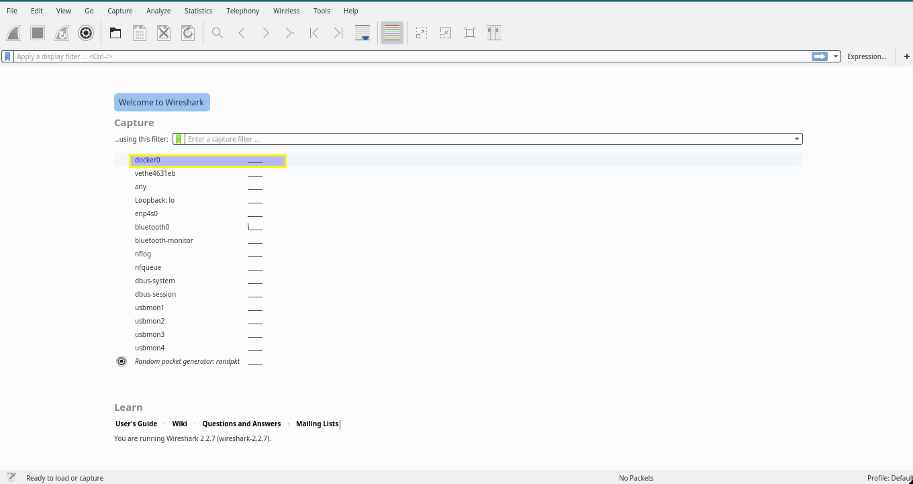
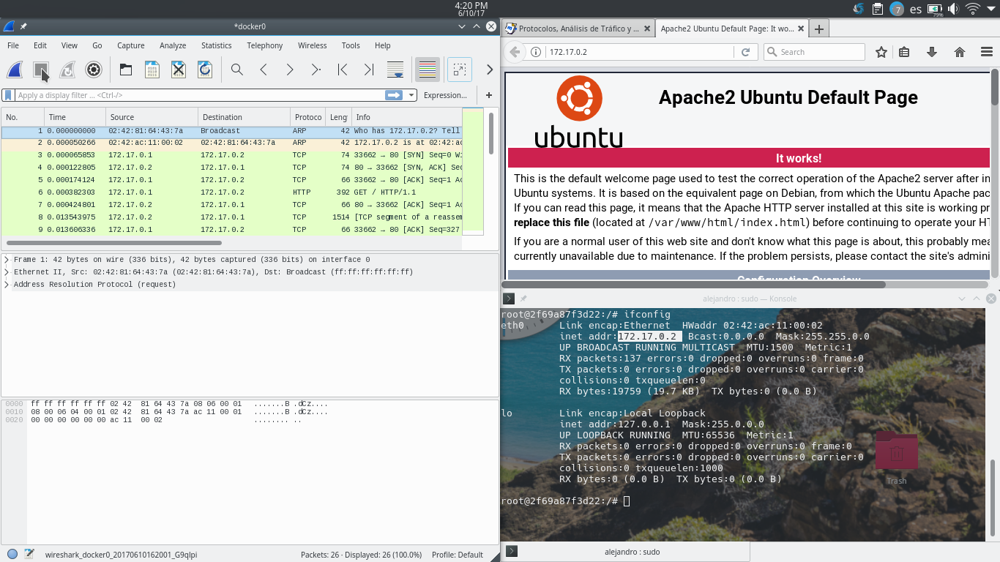
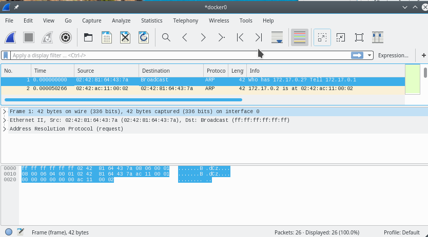
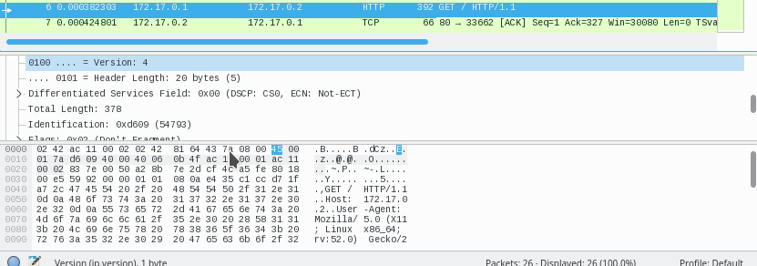
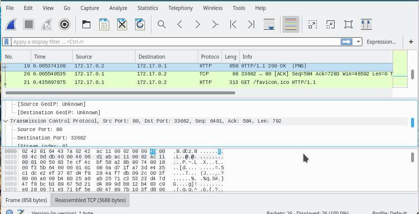
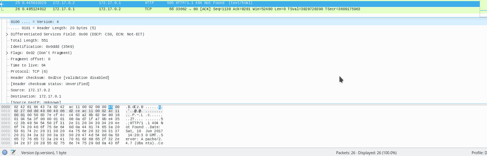

# Ejercicio:
## Revisar los análisis de tráfico que se ofrecen en [1].
## Instalar wireshark y observar cómo fluye el tráfico de red en uno de los servidores web mientras se le hacen peticiones HTTP 

Para probar wireshark, haré  unas peticiones a un servidor de las máquinas preparadas en las sesiones de prácticas con docker.

Para sacar las estadísticas de la interacción con la máquina abierta, voy a analizar la interfaz de red que genera docker. Se puede ver en la siguiente imagen el nombre de la interfaz:

Generamos las peticiones a la máquina servidora obteniendo los mensajes en wireshark:

## Análisis de paquetes transferidos:

En un primero momento, cuando el navegador pide la ip vemos que se extiende con un Broadcast por todas las interfaces de red. Como la pasarela de la IP está en la interfaz de docker, esta responde mirando si tiene esa ip completa, y como así es pues responde, veamoslo en la siguiente figura:

A continuación empieza el navegador y en servidor SYN y SYN-ACK:

Un poco después envía el navegador envía las cabeceras el navegador al servidor con la información que puede usarse en el cliente:

Cuando están de acuerdo, se envían la info desde el servidor al cliente, como se ve a continuación:

Al final parece que hay un fallo, aunque la web se muestra, da unos fallos en el servidor: 

El análisis completo está en [análisis.pcapng](https://github.com/alguacilaguamara/Servidores-Web-de-Altas-Prestaciones/blob/master/Ejercicios/T5/análisis.pcapng)

[1]http://bit.ly/1g0dkKj
