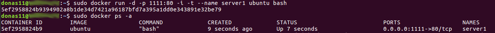
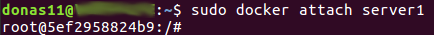
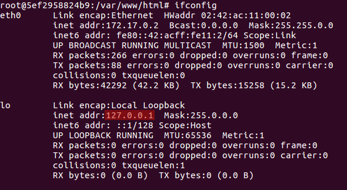
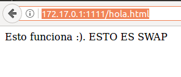
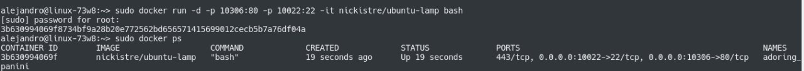
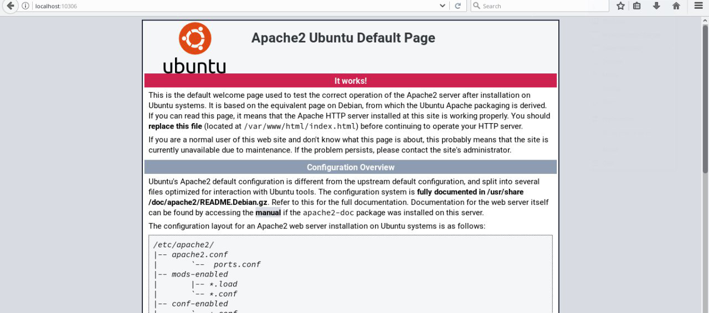

# Pruebas previas con Docker
## Iniciamos un contenedor con una imagen de ubuntu básica y asignado al puerto 80 al puerto 11111 del host (Instalación por pasos) 
~~~
sudo docker run -d -p 1111:80 -i -t --name server1 ubuntu bash
~~~

  * Actualizamos los repositorios
~~~
apt-get update
~~~
  * Instalamos LAMP (introducimos password para MySQL "root")
~~~
apt-get install apache2 mysql-server php libapache2-mod-php php-mysql
~~~
  * Instalamos herramientas de red (ifconfig)
~~~
apt-get install net-tools
~~~

  * Cambiamos al directorio que apache ha creado
~~~
cd var/www/html/
~~~

  * Creamos un archivo nuevo
~~~
echo "<HTML><BODY>Esto funciona :). ESTO ES SWAP </BODY></HTML>">hola.html
~~~

  * Reiniciamos servicio de Apache
~~~
service apache2 restart
~~~

  * Interfaces de redes en el contenedor

  * En la máquina host(anfitriona) en un navegador web
~~~
http://localhost:1111/hola.html
http://172.17.0.1:1111/hola.html
~~~

  *  y comprobamos que funciona el servidor y hay conexión

##  Iniciamos un contenedor con una imagen de ubuntu con servidor ya instalado y asignando los puertos 80 y 22 al puerto 10306 y al 100222 del host 
 
 * El contenedor contiene ya LAMP instalado  

 
 * y comprobamos que funciona el servidor y hay conexión

***
1: Se ha utilizado el puerto 1111, se puede cambiar a otro distinto disponible en la máquina host.

2: Se han utilizado los puertos 10306 y 10022, se pueden cambiar a otros disponibles en la máquina anfitriona.

