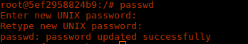

Instalamos SSH en los dos servidores
~~~
apt-get install openssh-server openssh-client
~~~

Como estamos trabajando como root utilizamos cambiamos la contraseña 
~~~
passwd
~~~
En el servidor 1

En el servidor 2

y en el archivo etc/ssh/sshd_config la opción PermitRootLogin 
 permitimos el uso de root por ssh que cambiando el parámetro por defecto de "prohibited-password" 
 

a "yes"

sin embargo en el contenedor que viene instalado por defecto LAMP esta configurado a "yes" por lo tanto no hay que modificarlo 

