# Práctica 2
## Probamos a copiar un archivo por ssh desde la máquina principal

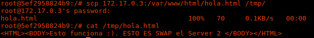

## Vamos a copiar la carpeta /var/ entre las dos máquinas

  * enviamos a la máquina 2 comprimida la carpeta
  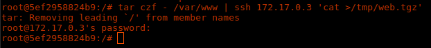

  * descomprimimos la carpeta y ya tenemos un clon de la carpeta de la máquina 1
  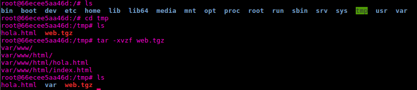

  * o también podría hacerse con la herramienta rsync y tendríamos también una clonación de la carpeta /var/www/
  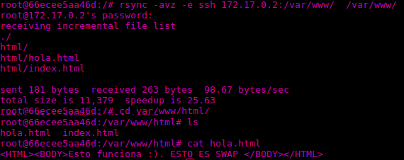

## Para configurar el ssh para acceder sin que solicite contraseña entre estas dos máquinas 
* generamos las claves privadas y públicas.

  * con dss:

  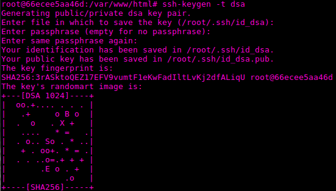

  * o con rsa:

  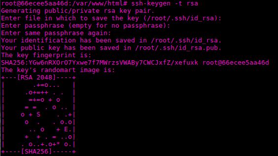

* Copiamos la clave pública
  
  * si es dss:
  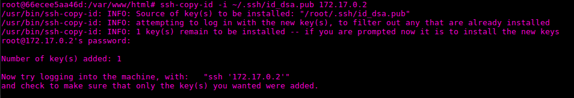

  * si es rsa:
  

* y comprobamos que podemos acceder mediante ssh sin necesidad de introducir contraseña
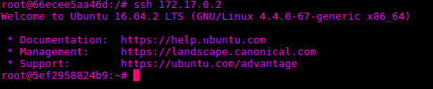

## Para establecer una tarea en cron que se ejecute cada hora para mantener actualizado el contenido del directorio /var/www entre las dos máquinas
  * ejecutamos 
~~~
crontab -e
~~~
  * y añadimos con el editor de textos una nueva linea de la siguiente forma:
  

  * reiniciamos el servicio cron
	
  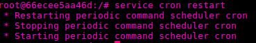

  * comprobamos que un archivo de prueba en el servidor uno
	  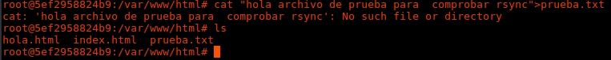

  * a la hora se copia en el servidor dos

  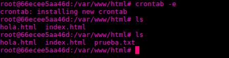

