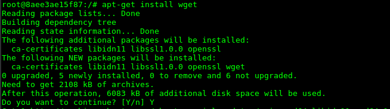
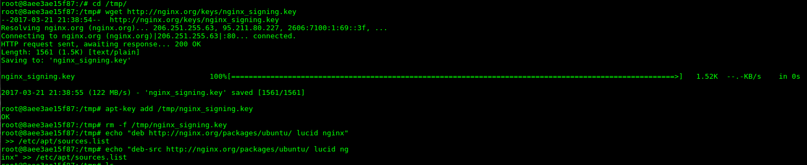
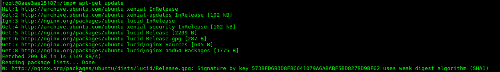
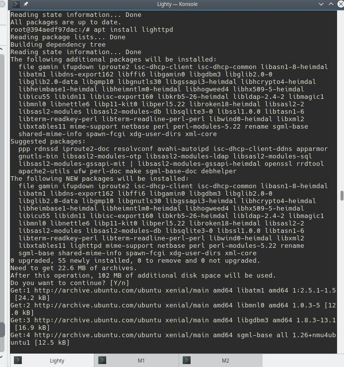

#Desactivación del cron 
En la práctica anterior teníamos activado la ejecución rutinaria de copiar el contenido de los archivos del servidor "activo" a un servidor "suplente" para hacer las comprobaciones de balanceos de cargas lo desactivamos comentando la linea en el cron

~~~
crontab -e
~~~

# Instalación en contenedores Ubuntu
## Nginx

importamos la clave del repositorio
~~~
cd /tmp/
wget http://nginx.org/keys/nginx_signing.key
apt-key add /tmp/nginx_signing.key
rm -f /tmp/nginx_signing.key
~~~

añadimos el repositorio
~~~
echo "deb http://nginx.org/packages/ubuntu/ lucid nginx" >> /etc/apt/sources.list
echo "deb-src http://nginx.org/packages/ubuntu/ lucid nginx" >> /etc/apt/sources.list
~~~

actualizamos los repositorios
~~~
apt-get update
~~~

instalamos nginx
~~~
apt-get install nginx
~~~

## Haproxy
Instalamos Haproxy
~~~
apt-get install haproxy
~~~

## Lighttpd
Instalamos Lighttpd
~~~
apt-get install lighttpd
~~~

# Instalación contenedor específico
## nginx
Obtenemos la imagen de nginx
~~~
sudo docker pull nginx
~~~

Creamos un contenedor de nginx

~~~
sudo docker run -d -i -t --name Balanceadornginx  nginx  bash
~~~
ya solo nos queda acceder 

~~~
sudo docker attach Balanceadornginx
~~~

## Haproxy
Obtenemos la imagen de haproxy
~~~
sudo docker pull haproxy
~~~

Creamos un contenedor de haproxy
~~~
sudo docker run -d -i -t --name BalanceadorHaproxy haproxy bash
~~~
