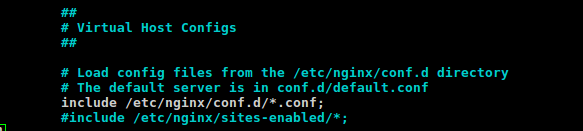

# Configurar una máquina e instalarle el nginx como balanceador de carga
## Configuramos los dos archivos de configuración

## Archivo /etc/nginx/conf.d/default.conf

## Archivo /etc/nginx/nginx.conf

## Reiniciamos servicio
~~~
service nginx restart
~~~

## Comprobamos que el balanceador funciona bien

# Configurar una máquina e instalarle el haproxy como balanceador de carga

## Configuramos archivo de configuración

## Reiniciamos servicio
~~~
/usr/sbin/haproxy -f /etc/haproxy/haproxy.cfg
~~~

	
## Comprobamos que el balanceador funciona bien

# Someter a la granja web a una alta carga, teniendo primero nginx y después haproxy. 

## nginx

## Haproxy

## Comparación

<table summary="Pruebas Apache Benchmark con Nginx y Haproxy">
	 	<thead>
		<tr>
<th scope="col"></th>
<th scope="col">Nginx</th>
<th scope="col">Haproxy</th>
		   </tr>
	       </thead>
<tbody>
		 <tr> 
<th>Time taken for tests:</th>
<td>0.159 seconds</td>
<td> 0.149 seconds </td>
		</tr>
		  
</tbody>
</table>

	
# Extra - lighttpd

## Configuramos archivo de configuración

## Reiniciamos servicio
~~~
service lighttpd restart
~~~

## Comprobamos que el balanceador funciona bien

## Someter a la granja web a una alta carga

## Comparación

<table summary="Pruebas Apache Benchmark con Nginx y Haproxy">
<thead>
		<tr>	
<th scope="col"></th>
<th scope="col">Nginx</th>
<th scope="col">Haproxy</th>
<th scope="col">lighttpd</th>
	   </tr>
</thead>
<tbody>
		 <tr> 
<th>Time taken for tests:</th>
<td>0.159 seconds</td>
<td> 0.149 seconds </td>
<td> 0.171 seconds </td>
		</tr>
</tbody>
</table>
