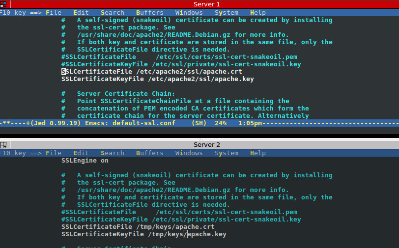
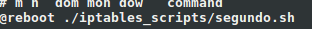
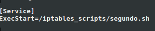

#Instalar un certificado SSL autofirmado para configurar el acceso HTTPS a los servidores.

## Creación certificados

Creación de certificados ,directorio

~~~
mkdir /etc/apache2/ssl
~~~

Certificado

~~~
openssl req -x509 -nodes -days 365 -newkey rsa:2048 -keyout /etc/apache2/ssl/apache.key -out /etc/apache2/ssl/apache.crt
~~~
Introducimos los datos que nos pide
~~~
Country Name (2 letter code) [AU]:ES
State or Province Name (full name) [Some-State]:Granada
Locality Name (eg, city) []:Granada
Organization Name (eg, company) [Internet Widgits Pty Ltd]:swap
Organizational Unit Name (eg, section) []:swap
Common Name (e.g. server FQDN or YOUR name) []:swap
Email Address []:info@swap.es
~~~

## Copia de certificados

Copiamos los certificados al servidor 2

~~~
scp /etc/apache2/ssl/apache.key 172.17.0.3:/tmp/keys/
~~~

Copiamos los certificados al balanceador

~~~
scp /etc/apache2/ssl/apache.key 172.17.0.4:/tmp/keys/
~~~

## Archivos de configuración
Modificamos el archivo /etc/apache2/sites-available/default-ssl.conf
agregando las lineas
~~~
SSLCertificateFile /etc/apache2/ssl/apache.crt
SSLCertificateKeyFile /etc/apache2/ssl/apache.key
~~~

Activamos el sitio default--ss
~~~
a2ensite default-ssl
~~~
Reiniciamos apache
~~~
service apache2 reload
~~~

## Nginx

Configuración nginx /etc/nginx/conf.d/default.conf

~~~
upstream apaches {
    server 172.17.0.2;
    server 172.17.0.3;
}

server{

    listen 80;
    listen 443 ssl;
    ssl on;
    ssl_certificate /tmp/keys/apache.crt;
    ssl_certificate_key /tmp/keys/apache.key;

    server_name balanceador;

    access_log /var/log/nginx/balanceador.access.log;
    error_log /var/log/nginx/balanceador.error.log;
    root /var/www/;

    location /
    {
       proxy_pass http://apaches;
       proxy_set_header Host $host;
       proxy_set_header X-Real-IP $remote_addr;
       proxy_set_header X-Forwarded-For $proxy_add_x_forwarded_for;
       proxy_http_version 1.1;
       proxy_set_header Connection "";
    }
}

~~~

## Haproxy

Guardamos el certificado en un archivo pem para introducirlo en la configuración de haproxy 

~~~
cat /tmp/keys/apache.crt /tmp/keys/apache.key | tee /tmp/keys/apache.pem
~~~

Configuración haproxy /etc/haproxy/haproxy.cfg

~~~
global
        daemon
        maxconn 256
        tune.ssl.default-dh-param 2048
defaults
        mode    http
        timeout connect 4000
        timeout client  42000
        timeout server  43000
        errorfile 400 /etc/haproxy/errors/400.http
        errorfile 403 /etc/haproxy/errors/403.http
        errorfile 408 /etc/haproxy/errors/408.http
        errorfile 500 /etc/haproxy/errors/500.http
        errorfile 502 /etc/haproxy/errors/502.http
        errorfile 503 /etc/haproxy/errors/503.http
        errorfile 504 /etc/haproxy/errors/504.http
frontend http-in
        bind *:80
        bind *:443 ssl crt /tmp/keys/apache.pem
        redirect scheme https if !{ ssl_fc }
        default_backend servers
backend servers
        server m1 172.17.0.2 maxconn 32
        server m2 172.17.0.3 maxconn 32
~~~

#Configurar las reglas del cortafuegos con IPTABLES para asegurar el acceso a los servidores web, permitiendo el acceso por los puertos de HTTP y HTTPS. Esta configuración se puede hacer en la misma máquina balanceadora. 

~~~
jed ./iptables_scripts/segundo.sh
~~~

~~~
#!/bin/bash
# -*- ENCODING: UTF-8 -*-
# (1) se eliminan todas las reglas que hubiera
# para hacer la configuración limpia:
iptables -F
iptables -X
# (2) establecer las políticas por defecto (denegar todo el tráfico):
iptables -P INPUT DROP
iptables -P OUTPUT DROP
iptables -P FORWARD DROP
# (3) permitir cualquier acceso desde localhost (interface lo):
iptables -A INPUT -i lo -j ACCEPT
iptables -A OUTPUT -o lo -j ACCEPT
# (4) Abrir el puerto 22 para permitir el acceso por SSH:
iptables -A INPUT -i eth0 -p tcp --dport 22 -j ACCEPT
iptables -A OUTPUT -o eth0 -p udp --sport 22 -j ACCEPT
# (5) Abrir los puertos HTTP/HTTPS (80 y 443) de servidor web:
iptables -A INPUT -i eth0 -m state --state NEW -p tcp --dport 80 -j ACCEPT
iptables -A OUTPUT -o eth0 -m state --state NEW -p udp --sport 80 -j ACCEPT
iptables -A INPUT -i eth0 -m state --state NEW -p tcp --dport 443 -j ACCEPT
iptables -A OUTPUT -o eth0 -m state --state NEW -p udp --sport 443 -j ACCEPT
~~~

# En cualquier caso se debe poner en un script que se ejecute en el arranque del sistema.
~~~
crontab -e
~~~
Añadir
~~~
@reboot ./iptables_scripts/segundo.sh
~~~

o 
~~~
/etc/systemd/system/sysinit.target.wants/systemd-timesyncd.service
~~~

~~~
systemctl daemon-reload
systemctl start segundo.service
systemctl enable segundo.service
~~~

# Parte opcional
### Realizar la configuración del cortafuegos en una máquina diferente a la del balanceador de carga, liberando a éste de la carga que suponen las tareas de cortafuegos

IP del balaceador: 172.17.0.4
IP del firewall: 172.17.0.5
~~~
#!/bin/sh

#habilitamos en el kernel el redireccionamiento
echo 1 > /proc/sys/net/ipv4/ip_forward

# (1) Eliminar todas las reglas (configuraci  n limpia)
iptables -F
iptables -t nat -F
iptables -X
iptables -t nat -X

# (2) Pol  tica por defecto: denegar todo el tr  fico
iptables -P INPUT DROP
iptables -P OUTPUT DROP

# (3) Permitir cualquier acceso desde localhost (interface lo)
iptables -A INPUT -i lo -j ACCEPT
iptables -A OUTPUT -o lo -j ACCEPT

# (4) Abrir el puerto 22 para permitir el acceso por SSH
iptables -A INPUT -p tcp --dport 22 -j ACCEPT
iptables -A OUTPUT -p tcp --sport 22 -j ACCEPT

# (5) Abrir los puertos HTTP (80) de servidor web
iptables -A INPUT -p tcp --dport 80 -j ACCEPT

# (6) Abrir los puertos HTTPS (443) de servidor web
iptables -A INPUT -p tcp --dport 443 -j ACCEPT
iptables -A OUTPUT -p tcp --sport 443 -j ACCEPT

#redireccionamiento HTTP
iptables -t nat -A PREROUTING -p tcp --dport 443 -j DNAT --to-destination 172.17.0.4:443
iptables -t nat -A POSTROUTING -p tcp -d 172.17.0.4 --dport 443 -j SNAT --to-source 172.17.0.5

~~~
