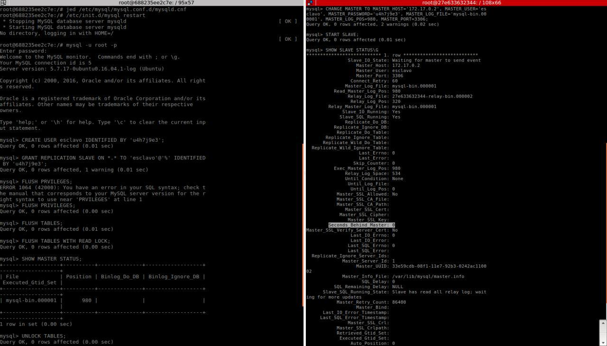

# Crear una BD con al menos una tabla y algunos datos
## Creación Base de datos y banco de datos
~~~
CREATE DATABASE Practicas;
USE Practicas;
~~~

[Archivo BD SQL](./BD.sql) 
~~~
CREATE TABLE Persona( 
    	Id VARCHAR(9) NOT NULL,
	Nombre VARCHAR(30) NOT NULL,
	Apellido_primer VARCHAR(30) NOT NULL,
	Apellido_segundo VARCHAR(30) NOT NULL
);
~~~

~~~
INSERT INTO Persona VALUES('000000000','Maribel','Rodríguez','Sola');
INSERT INTO Persona VALUES('000000001','Veronica','González','Abad');
INSERT INTO Persona VALUES('000000002','José','Rodríguez','Fernández');
INSERT INTO Persona VALUES('000000003','Alicia','Pérez','García');
INSERT INTO Persona VALUES('000000004','Maribel','López','Amaya');
INSERT INTO Persona VALUES('000000005','Uriel','Camps','Antúnez');
INSERT INTO Persona VALUES('000000006','Gema','Gómez','Torres');
INSERT INTO Persona VALUES('000000007','Maribel','Sosa','Álvarez');
INSERT INTO Persona VALUES('000000008','Ursula','Carmona','Alcalde');
INSERT INTO Persona VALUES('000000009','Yvonne','Ballesteros','Delgado');
INSERT INTO Persona VALUES('000000010','Julio','Escobar','Estévez');
INSERT INTO Persona VALUES('000000011','Erik','Díaz','Expósito');
~~~

# Realizar la copia de seguridad de la BD completa usando mysqldump
Accedemos
~~~
mysql -u root –p
~~~
y bloquemos las tablas y salimos
~~~
FLUSH TABLES WITH READ LOCK;
quit
~~~

~~~
mysqldump Practicas -u root -p > /BDS/Practicas.sql
~~~
Volvemos a acceder
~~~
mysql -u root –p
~~~
y debloquemos las tablas y salimos
~~~
UNLOCK TABLES;
quit
~~~

# Restaurar dicha copia en la segunda máquina (clonado manual de la BD).

hacemos una copia del archivo que exportamos en el primer servidor en el segundo servidor y lo modificamos

jed /tmp/Practicas.sql

y añadimos 
~~~ 
CREATE DATABASE Practicas;
USE Practicas;
~~~
de tal forma que quedará algo así:

~~~
-- MySQL dump 10.13  Distrib 5.7.17, for Linux (x86_64)
--
-- Host: localhost    Database: Practicas
-- ------------------------------------------------------
-- Server version	5.7.17-0ubuntu0.16.04.1-log

CREATE DATABASE Practicas;
USE Practicas;

/*!40101 SET @OLD_CHARACTER_SET_CLIENT=@@CHARACTER_SET_CLIENT */;
/*!40101 SET @OLD_CHARACTER_SET_RESULTS=@@CHARACTER_SET_RESULTS */;
/*!40101 SET @OLD_COLLATION_CONNECTION=@@COLLATION_CONNECTION */;
/*!40101 SET NAMES utf8 */;
/*!40103 SET @OLD_TIME_ZONE=@@TIME_ZONE */;
/*!40103 SET TIME_ZONE='+00:00' */;
/*!40014 SET @OLD_UNIQUE_CHECKS=@@UNIQUE_CHECKS, UNIQUE_CHECKS=0 */;
/*!40014 SET @OLD_FOREIGN_KEY_CHECKS=@@FOREIGN_KEY_CHECKS, FOREIGN_KEY_CHECKS=0 */;
/*!40101 SET @OLD_SQL_MODE=@@SQL_MODE, SQL_MODE='NO_AUTO_VALUE_ON_ZERO' */;
/*!40111 SET @OLD_SQL_NOTES=@@SQL_NOTES, SQL_NOTES=0 */;

--
-- Table structure for table `Persona`
--

DROP TABLE IF EXISTS `Persona`;
/*!40101 SET @saved_cs_client     = @@character_set_client */;
/*!40101 SET character_set_client = utf8 */;
CREATE TABLE `Persona` (
  `Id` varchar(9) NOT NULL,
  `Nombre` varchar(30) NOT NULL,
  `Apellido_primer` varchar(30) NOT NULL,
  `Apellido_segundo` varchar(30) NOT NULL
) ENGINE=InnoDB DEFAULT CHARSET=latin1;
/*!40101 SET character_set_client = @saved_cs_client */;

--
-- Dumping data for table `Persona`
--

LOCK TABLES `Persona` WRITE;
/*!40000 ALTER TABLE `Persona` DISABLE KEYS */;
INSERT INTO `Persona` VALUES ('000000000','Maribel','Rodrguez','Sola'),('000000001','Veronica','Gonzlez','Abad'),('000000002','Jos','Rodrguez','Fernndez'),('000000003','Alicia','Prez','Garca'),('000000004','Maribel','Lpez','Amaya'),('000000005','Uriel','Camps','Antnez'),('000000006','Gema','Gmez','Torres'),('000000007','Maribel','Sosa','lvarez'),('000000008','Ursula','Carmona','Alcalde'),('000000009','Yvonne','Ballesteros','Delgado'),('000000010','Julio','Escobar','Estvez'),('000000011','Erik','Daz','Expsito');
/*!40000 ALTER TABLE `Persona` ENABLE KEYS */;
UNLOCK TABLES;
/*!40103 SET TIME_ZONE=@OLD_TIME_ZONE */;

/*!40101 SET SQL_MODE=@OLD_SQL_MODE */;
/*!40014 SET FOREIGN_KEY_CHECKS=@OLD_FOREIGN_KEY_CHECKS */;
/*!40014 SET UNIQUE_CHECKS=@OLD_UNIQUE_CHECKS */;
/*!40101 SET CHARACTER_SET_CLIENT=@OLD_CHARACTER_SET_CLIENT */;
/*!40101 SET CHARACTER_SET_RESULTS=@OLD_CHARACTER_SET_RESULTS */;
/*!40101 SET COLLATION_CONNECTION=@OLD_COLLATION_CONNECTION */;
/*!40111 SET SQL_NOTES=@OLD_SQL_NOTES */;

-- Dump completed on 2017-06-05 23:28:11

~~~

y utilizamos para restaurar la base de datos en esta máquina
~~~
mysql -u root -p Practicas < /tmp/Practicas.sql
~~~

# Realizar la configuración maestro-esclavo de los servidores MySQL para que la replicación de datos se realice automáticamente.

## MAESTRO ESCLAVO

### Configuración Archivo -Paso 1  
__MAESTRO__
~~~
jed /etc/mysql/mysql.conf.d/mysqld.cnf
~~~
comentamos 
~~~
#bind-address 127.0.0.1
~~~
añadimos
~~~
log_error = /var/log/mysql/error.log
log_bin = /var/log/mysql/bin.log
server-id = 1
~~~
reiniciamos el servicio
~~~
/etc/init.d/mysql restart 
~~~
__ESCLAVO__
~~~
jed /etc/mysql/mysql.conf.d/mysqld.cnf
~~~
comentamos 
~~~
#bind-address 127.0.0.1
~~~
añadimos
~~~
log_error = /var/log/mysql/error.log
log_bin = /var/log/mysql/bin.log
server-id = 2
~~~
reiniciamos el servicio
~~~
/etc/init.d/mysql restart 
~~~

### Crear Usuario- Paso 2
__MAESTRO__
~~~
CREATE USER esclavo IDENTIFIED BY 'esclavo';
GRANT REPLICATION SLAVE ON *.* TO 'esclavo'@'%' IDENTIFIED BY 'u4h7j9e3';
FLUSH PRIVILEGES;
FLUSH TABLES;
FLUSH TABLES WITH READ LOCK;
~~~

### Obtenemos Datos Master - Paso 3
__MAESTRO__
~~~
SHOW MASTER STATUS;
~~~

### Cambiamos el Master del esclavo - Paso 4
__ESCLAVO__
~~~
CHANGE MASTER TO MASTER_HOST='172.17.0.2',MASTER_USER='esclavo', MASTER_PASSWORD='u4h7j9e3',MASTER_LOG_FILE='mysql-bin.000010', MASTER_LOG_POS=154,MASTER_PORT=3306;
~~~

iniciamos esclavo
~~~
START SLAVE;
~~~

### Desbloqueamos tablas - Paso 5
__MAESTRO__
~~~
UNLOCK TABLES;
~~~

### Mostramos estado de Esclavo - Paso 6
__ESCLAVO__
~~~
SHOW SLAVE STATUS\G
~~~
comprobamos que:
~~~
Seconds_Behind_Master: 0
~~~
es decir es distinto de NULL

# Tarea opcional para conseguir una mayor nota en esta práctica, se propone realizar la configuración maestro-maestro entre las dos máquinas de bases de datos.

## MAESTRO - MAESTRO
### ESCLAVO 
~~~
CREATE USER maestro IDENTIFIED BY 'u4h7j9e3';
GRANT REPLICATION SLAVE ON *.* TO 'maestro'@'%' IDENTIFIED BY 'u4h7j9e3';
FLUSH PRIVILEGES;
FLUSH TABLES;
FLUSH TABLES WITH READ LOCK;
~~~

~~~
update user set host='%' where user='root';
~~~

~~~
SHOW MASTER STATUS;
~~~

### MAESTRO 
~~~
CHANGE MASTER TO MASTER_HOST='172.17.0.3',MASTER_USER='maestro', MASTER_PASSWORD='u4h7j9e3',MASTER_LOG_FILE='mysql-bin.000010', MASTER_LOG_POS=154,MASTER_PORT=3306;
~~~

~~~
SHOW SLAVE STATUS\G
~~~

	