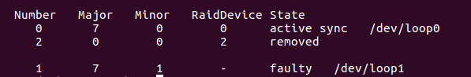

# Realizar la configuración de dos discos en RAID 1 bajo Ubuntu, automatizando el montaje del dispositivo creado al inicio del sistema. 
~~~
mdadm -C /dev/md0 --level=raid1 --raid-devices=2 /dev/loop0 /dev/loop1
~~~
montamos la unidad y creamos archivo en ella

comprobamos el estado del RAID

ejecutamos 
~~~
blkid
~~~ 
para ver el UUID del dispositivo

y en el archivo /etc/fstab/ añadir
~~~
UUID=f9a8338f-01ec-4ae4-b088-818459b96b39 /dat ext2 defaults 0 0
~~~

# Simular un fallo en uno de los discos del RAID (mediante comandos con el mdadm), retirarlo “en caliente”, comprobar que se puede acceder a la información que hay almacenada en el RAID, y por último, añadirlo al conjunto y comprobar que se reconstruye correctamente.

Simulamos fallo

Vemos estado RAID

Extraemos unidad
![img] (./imágenes/extracci%C3%B3nencaliente.png)

comprobamos estado y acceso a los datos

volvemos añadir la unidad

comprobamos que se empieza a reconstruir

al rato vuelve a estar en el estado inicial

# Parte Opcional
## Máquina RAID - Servidor
~~~
apt-get update
apt-get upgrade
apt-get install nfs-kernel-server rpcbind
~~~
abrimos archivo /etc/exports y añadimos
~~~
/dat *(rw,sync,fsid=0,no_subtree_check,no_root_squash)
~~~

reiniciamos servicios
~~~
/etc/init.d/rpcbind restart
/etc/init.d/nfs-kernel-server restart
~~~
o
~~~
service nfs restart
~~~

comprobamos que esta funcionando el socket para nfs:
~~~
rpcinfo -p
~~~

comprobamos que es lo que esta compartiendo  
~~~
showmount -e localhost
~~~

## Máquina Cliente
~~~
apt-get update
apt-get upgrade
apt-get install nfs-common rpcbind
~~~
comprobamos que montajes tenemos en el servidor
~~~
showmount -e 172.17.0.2
~~~

montamos en el cliente
~~~
sudo mount 172.17.0.2:/dat /home/donas11/NFSMontaje/
~~~

y desde el servidor creamos un archivo de prueba

y en la máquina cliente vemos que tambien aparece:

	

