# Recreación de las prácticas de SWAP en equipos reales.

# Trabajo realizado por:
## [Julián Cifuentes Jiménez](https://github.com/juliancifuentes95)
## [José Álvaro Garrido López](https://github.com/alvarospunk)
##  [Alejandro Francisco Alguacil Camarero](https://github.com/alguacilaguamara)
##  [Alejandro Manuel do Nascimento Rodríguez](https://github.com/donas11)

## Introducción

Nuestro trabajo consiste en recrear las prácticas de la asignatura en un servidor casero, con el objetivo de observar a ras de circuito la importancia y el funcionamiento de las herramientas que hemos utilizado en el curso.

Para ello, hemos puesto a punto cuatro máquinas, las cuales tendrán como fin aunar potencia de cómputo y memoria para procesar las peticiones que lleguen al mismo. Una de estas máquinas será el balanceador de carga, el cual se encargará de repartir el grueso de las peticiones entre las máquinas preparadas para tal efecto. Todas ellas vendrán provistas de unos cuantos servidores web (Apache) y una base de datos (MariaDB), utilizando como motor de virtualización los contenedores de Docker, intentando sacarle el máximo jugo a esta útil herramienta. Posteriormente entraremos en más detalles sobre la puesta a punto de los servidores y la configuración que hemos tenido que realizar sobre los mismos.

Para ello vamos a utilizar Docker.

# ¿Qué es Docker?

Docker es una plataforma de software que le permite crear, probar e implementar aplicaciones rápidamente. Docker empaqueta software en unidades estandarizadas llamadas contenedores que incluyen todo lo necesario para que el software se ejecute, incluidas bibliotecas, herramientas de sistema, código y tiempo de ejecución. Con Docker, se puede implementar y ajustar la escala de aplicaciones rápidamente en cualquier entorno con la certeza de saber que el código se ejecutará.

## Ventajas de Docker

#### Mejora la productividad de desarrollo Docker 
#### Reduce el tiempo empleado en configurar nuevos entornos o en solucionar los problemas asociados con el uso de entornos diferentes
#### Estandariza las operaciones de aplicaciones 
#### Las aplicaciones con contenedores facilitan la implementación, la identificación de problemas y el retorno a una fase anterior para remediarlos

## Empresas que lo utilizan

Organizaciones contribuidoras apuestan por Docker:

* Red Hat
* IBM 
* Google por ejemplo con Google Container Engine y Kubernetes 
* NETFLIX utiliza a nivel muy bajo contenedores dockers en sus servidores de Amazon EC2 Container Service ya que este proporciona soporte técnico para Docker
* HPE - Composable Infrastructure Partner Program
* ADP
* Paypal

## Ideas
### Configuraciones iniciales que desechamos

### Ideas iniciales: conexiones de dispositivos 
### Idea principal
La idea principal para dar el servicio del servidor fue conectar todos los ordenadores y configurar alguno de los routers secundarios que tuviésemos en desuso para que emitiese una red WiFi conectando todos nuestros portátiles por cable, razones por las que se descarto:

* Los routers que teníamos no permitían hacer la configuración o teníamos que modificar partes del hardware soldando algunas conexiones.
* Las conexiones de uno de los portátil necesitaba un adaptador de conexiones(usb-c) a red(Gigabit Ethernet) que costaba unos 33€, esto se solucionaba conectándolo por wifi

### Segunda idea
Descartando la anterior idea, escogimos optar por una mejora de la anterior la cual fue conectar todos los ordenadores al router y desde el ordenador balanceador de carga que era por el que tendrían que acceder al servicio y montar con una tarjeta WiFi interna del portátil o externa (con esta opción se dispondría de acceso a internet) emitiendo una red WiFi, los motivos por que la desechamos:

* La prueba que realizamos en clase funcionó bien, excepto a una persona con un móvil pero el sistema en sí funciono decentemente
* Se intentó crear un servidor con DNS local para facilitar el acceso y no tener que dar una IP, pero no se obtuvieron resultados

### Últimas ideas
Concluimos después de las ideas anteriores era mejor tener una direccion en vez de una IP y por eso discutimos entre las dos siguientes posiciones:

* Dejar todos los ordenadores en red en una de nuestra casas
* Dejar distribuidos los equipos en cada casa con cada uno de nuestro ISP(Internet Service Provider)

Finalmente optamos por distribuirlos y configurarlos y configurarlos con No-ip para tener una dirección en vez de una IP

## Ideas conexiones de contenedores 
Aquí se muestran las ideas que teníamos en principio para organizar los contenedores y las conexiones entre ellos.
### Idea Inicial de estructura 
Nuestra idea principal era la de tener dos balanceadores uno para servidores Apache y otro para las bases de datos, pero desechamos la idea ya que no se conseguía configurar con HAProxy con varias configuraciones que se probaron
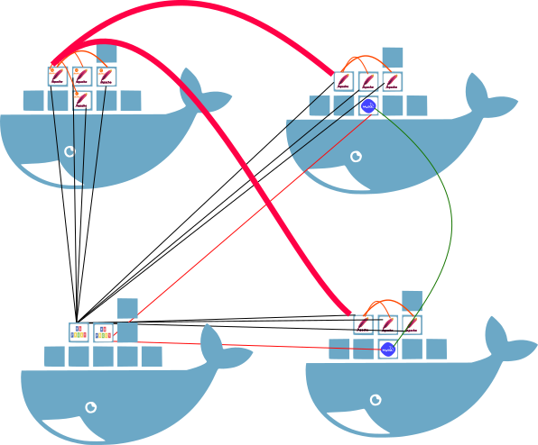

### Idea final de la estructura 
La idea final fue la de tener un balanceador de servidores, servidores Apache, dos bases de datos y uno con un dispositivo RAID
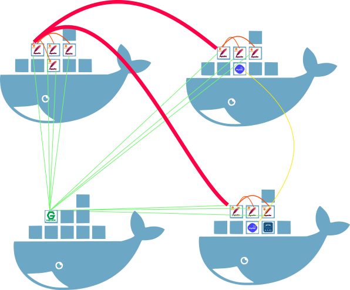

##Creamos un nuevo contenedor

~~~
sudo docker run -d -p 80:80 -p 443:443 -p 10022:22 -i -t --name BalanceadorTrabajo nginx bash
~~~

##accedemos

~~~
sudo docker attach BalanceadorTrabajo
~~~

##modificamos archivo /etc/nginx/conf.d/default.conf

~~~
upstream apaches {
    	ip_hash;
    	server alvarospunk.ddns.net:1217;
    	server juliansito.ddns.net:1113;
    	server juliansito.ddns.net:1117;
    	server juliansito.ddns.net:1121;
    	server donas11.hopto.org:1113;
    	server donas11.hopto.org:1117;
    	server donas11.hopto.org:1121;
    	server juliansito.ddns.net:1125;
	}
server{
    	listen 80;
     	listen 443 ssl;
     	ssl on;
     	ssl_certificate    	/tmp/apache.crt;
     	ssl_certificate_key	/tmp/apache.key;
    	server_name balanceador;
    	access_log /var/log/nginx/balanceador.access.log;
    	error_log /var/log/nginx/balanceador.error.log;
    	root /var/www/;
    	location /
    	{
            	proxy_pass https://apaches;
            	proxy_set_header Host $host;
            	proxy_set_header X-Real-IP $remote_addr;
            	proxy_set_header X-Forwarded-For $proxy_add_x_forwarded_for;
            	proxy_http_version 1.1;
            	proxy_set_header Connection "";
    	}
}
~~~

## reiniciamos servicio

~~~
service nginx restart
~~~

~~~
sudo docker run -d -p 1111:80 -p 1112:22 -p 1113:443 -p 1114:3306 -i -t --name ApacheTrabajo1 ubuntu bash
~~~

<table cellspacing="0" border="0">
	<colgroup width="92"></colgroup>
	<colgroup width="128"></colgroup>
	<colgroup width="85"></colgroup>
	<tr>
		<td height="17" align="center"><b>Puertos Host</b></td>
		<td align="center"><b>Puertos contenedor</b></td>
		<td align="center"><b>Utilizado para</b></td>
	</tr>
	<tr>
		<td height="17" align="center" sdval="1111" sdnum="3082;">1111</td>
		<td align="center" sdval="80" sdnum="3082;">80</td>
		<td align="center">HTTP</td>
	</tr>
	<tr>
		<td height="17" align="center" sdval="1112" sdnum="3082;">1112</td>
		<td align="center" sdval="22" sdnum="3082;">22</td>
		<td align="center">SSH</td>
	</tr>
	<tr>
		<td height="17" align="center" sdval="1113" sdnum="3082;">1113</td>
		<td align="center" sdval="443" sdnum="3082;">443</td>
		<td align="center">HTTPS</td>
	</tr>
	<tr>
		<td height="17" align="center" sdval="1114" sdnum="3082;">1114</td>
		<td align="center" sdval="3306" sdnum="3082;">3306</td>
		<td align="center">MySQL</td>
	</tr>
</table>

~~~
apt-get update
~~~
~~~
apt-get install apache2 php libapache2-mod-php php-mysql
~~~
~~~
apt-get install openssh-server openssh-client
~~~
~~~
apt-get install rsync 
~~~
~~~
apt-get install cron
~~~

~~~
sudo docker export --output=ApacheTrabajo.tar ApacheTrabajo
~~~

~~~
sudo docker images
~~~

~~~
REPOSITORY                TAG                 IMAGE ID            CREATED             SIZE
<none>					<none>				ce51d2645415		3 seconds ago		302.6 MB
~~~

~~~
sudo docker run -d -p 1115:80 -p 1116:22 -p 1117:443 -p 1118:3306 -i -t --name ApacheTrabajo2 ce51d2645415 bash
~~~

<table cellspacing="0" border="0">
	<colgroup span="3" width="85"></colgroup>
	<tr>
		<td height="17" align="center"><b>Puertos Host</b></td>
		<td align="center"><b>Puertos contenedor</b></td>
		<td align="center"><b>Utilizado para</b></td>
	</tr>
	<tr>
		<td height="17" align="center" sdval="1115" sdnum="3082;">1115</td>
		<td align="center" sdval="80" sdnum="3082;">80</td>
		<td align="center">HTTP</td>
	</tr>
	<tr>
		<td height="17" align="center" sdval="1116" sdnum="3082;">1116</td>
		<td align="center" sdval="22" sdnum="3082;">22</td>
		<td align="center">SSH</td>
	</tr>
	<tr>
		<td height="17" align="center" sdval="1117" sdnum="3082;">1117</td>
		<td align="center" sdval="443" sdnum="3082;">443</td>
		<td align="center">HTTPS</td>
	</tr>
	<tr>
		<td height="17" align="center" sdval="1118" sdnum="3082;">1118</td>
		<td align="center" sdval="3306" sdnum="3082;">3306</td>
		<td align="center">MySQL</td>
	</tr>
</table>

~~~
sudo docker run -d -p 1119:80 -p 1120:22 -p 1121:443 -p 1122:3306 -i -t --name ApacheTrabajo3 ce51d2645415 bash
~~~

<table cellspacing="0" border="0">
	<colgroup span="3" width="85"></colgroup>
	<tr>
		<td height="17" align="center"><b>Puertos Host</b></td>
		<td align="center"><b>Puertos contenedor</b></td>
		<td align="center"><b>Utilizado para</b></td>
	</tr>
	<tr>
		<td height="17" align="center" sdval="1119" sdnum="3082;">1119</td>
		<td align="center" sdval="80" sdnum="3082;">80</td>
		<td align="center">HTTP</td>
	</tr>
	<tr>
		<td height="17" align="center" sdval="1120" sdnum="3082;">1120</td>
		<td align="center" sdval="22" sdnum="3082;">22</td>
		<td align="center">SSH</td>
	</tr>
	<tr>
		<td height="17" align="center" sdval="1121" sdnum="3082;">1121</td>
		<td align="center" sdval="443" sdnum="3082;">443</td>
		<td align="center">HTTPS</td>
	</tr>
	<tr>
		<td height="17" align="center" sdval="1122" sdnum="3082;">1122</td>
		<td align="center" sdval="3306" sdnum="3082;">3306</td>
		<td align="center">MySQL</td>
	</tr>
</table>

~~~
sudo docker run -d -p 1123:80 -p 1124:22 -p 1125:443 -p 1126:3306 -i -t --name ApacheTrabajo3 ce51d2645415 bash
~~~

<table cellspacing="0" border="0">
	<colgroup span="3" width="85"></colgroup>
	<tr>
		<td height="17" align="center"><b>Puertos Host</b></td>
		<td align="center"><b>Puertos contenedor</b></td>
		<td align="center"><b>Utilizado para</b></td>
	</tr>
	<tr>
		<td height="17" align="center" sdval="1119" sdnum="3082;">1123</td>
		<td align="center" sdval="80" sdnum="3082;">80</td>
		<td align="center">HTTP</td>
	</tr>
	<tr>
		<td height="17" align="center" sdval="1120" sdnum="3082;">1124</td>
		<td align="center" sdval="22" sdnum="3082;">22</td>
		<td align="center">SSH</td>
	</tr>
	<tr>
		<td height="17" align="center" sdval="1121" sdnum="3082;">1125</td>
		<td align="center" sdval="443" sdnum="3082;">443</td>
		<td align="center">HTTPS</td>
	</tr>
	<tr>
		<td height="17" align="center" sdval="1122" sdnum="3082;">1126</td>
		<td align="center" sdval="3306" sdnum="3082;">3306</td>
		<td align="center">MySQL</td>
	</tr>
</table>

##Configuración SSH copia automática
Creamos la clave
~~~
keygen -t rsa
~~~

La copiamos en la máquina principal de nuestros contenedores
~~~
ssh# ssh-copy-id -i ~/.ssh/id_rsa 172.17.0.2
~~~

* sudo docker run -d -p 1111:80 -p 1112:22 -p 1113:443 -p 1114:3306 -i -t --name ApacheTrabajo ce51d2645415 bash
* sudo docker run -d -p 1115:80 -p 1116:22 -p 1117:443 -p 1118:3306 -i -t --name ApacheTrabajo ce51d2645415 bash
* sudo docker run -d -p 1119:80 -p 1120:22 -p 1121:443 -p 1122:3306 -i -t --name ApacheTrabajo ce51d2645415 bash
* sudo docker run -d -p 10022:22 -p 3306:3306 -i -t --name BDTrabajo mysql bash

# 
## Descripción
El objetivo de esta página web es gestionar la entrada y salida de usuarios registrados, guardar datos de aspectos técnicos del servidor y del cliente, y ver porcentajes sobre los datos guardados

## Objetivos
* El sistema almacenará datos
* El sistema mostrará datos de una forma visual
* El sistema permitirá acceder mediante usuario y contraseña
* El sistema permitirá salir 

## Descripción de los implicados
### Entorno de usuario
Los usuarios directos de la aplicación a desarrollar es el usuario registrado que dispone de todas las opciones de la pagina web

### Resumen de los implicados

<table border="0" cellspacing="0" cellpadding="0" class="ta1"><colgroup><col width="134"/><col width="194"/><col width="99"/><col width="99"/></colgroup><tr class="ro1"><td style="text-align:left;width:30.76mm; " class="ce3">
Nombre
</td><td style="text-align:left;width:44.38mm; " class="ce3">
Descripción 
</td><td style="text-align:left;width:22.58mm; " class="ce3">
Tipo
</td><td style="text-align:left;width:22.58mm; " class="ce3">
Responsabilidad
</td></tr><tr class="ro1"><td style="text-align:left;width:30.76mm; " class="Default">
Usuario registrado 
</td><td style="text-align:left;width:44.38mm; " class="Default">
Representa un usuario registrado
</td><td style="text-align:left;width:22.58mm; " class="Default">
Usuario del sistema
</td><td style="text-align:left;width:22.58mm; " class="Default">
Iniciar sesión, cerrar sesión, guardar datos y visualizar porcentajes
</td></tr></table>

### Criterios de Exito
* Usuario registrado: Que el sistema le permita utilizar la navegación de forma sencilla y rápida. 

### Requisitos Funcionales
* **RF-1. Iniciar sesión** El sistema realizará una consulta 
	* RF-1.1. El sistema será capaz de responder al entrar
* **RF-2. Guardar Datos** El sistema guardará los datos
	* RF-2.1. El sistema será capaz de almacenar los datos
* **RF-3. ver estadisticas** El sistema mostrará los datos
	* RF-3.1. El sistema será capaz de mostrar porcentajes de datos guardados
* **RF-4. Cerrar sesión** El sistema eliminará los datos 
	* RF-4.1. El sistema borrará todos los datos utilizados en la sesión 

### Requisitos No Funcionales
* **RNF1** Es necesario de conocimientos iniciales de navegación por web
* **RNF2** No es necesario documentación al usuario
* **RNF3** Es necesario la utilización de un navegador de Internet
* **RNF4** El sistema debe ser estable y escalable
* **RNF5** El sistema debe soportar un número indefinido de usuarios
simultáneamente
* **RNF6** El sistema debe de ser veloz y con los mínimos tiempos de
carga posibles.

### Requisitos de Información
* ** RI1 Iniciar Sesión**
	* Imformación de usuario 
	* **Contenido:** un usuario esta identificado por su usuario y la contraseña  
	* **Requisitos asociados:** RF-1, RF-2,RF-3,RF-4

* ** RI2 Datos**
	* Información del servidor y del cliente
	* **Contenido:** Información destinada para guardar direcciones IP, sistemas operativos, navegadores tamaños de pantalla y usuario
	* **Requisitos asociados:**RF2,RF3

## Diagramas

### Diagramas de caso de uso
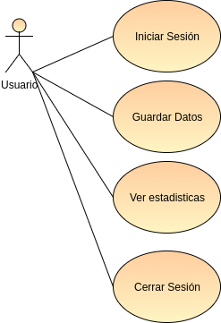

### Descripción Extendida de los casos de usos
#### Iniciar sesión

<table class="tg">
  <tr>
    <th class="tg-9hbo">Casos de uso</th>
    <th class="tg-yw4l" colspan="4">Iniciar sesión</th>
    <th class="tg-yw4l" colspan="2">CU-1</th>
  </tr>
  <tr>
    <th class="tg-yw4l">Actores</th>
    <td class="tg-yw4l" colspan="6"> Usuario</td>
  </tr>
  <tr>
    <th class="tg-yw4l">Tipo</th>
   <td class="tg-yw4l" colspan="2">Primário</td>
   <td class="tg-yw4l" colspan="2">Esencial</td>
   <td class="tg-yw4l" colspan="2">Básico</td>
  </tr>
  <tr>
    <th class="tg-yw4l">Referencias</th>
  <td class="tg-yw4l" colspan="6">RF-1.1</td>
  </tr>
  <tr>
    <th class="tg-yw4l">Precondición</th>
    <td class="tg-yw4l" colspan="6">El usuario debe de estar dado de alta </td>
  </tr>
  <tr>
    <th class="tg-yw4l">Postcondición</th>
    <td class="tg-yw4l" colspan="6">El usuario accede </td>
  </tr>
</table>

<table class="tg">
  <tr>
    <th class="tg-yw4l" colspan="7">Próposito</th>
  </tr>
  <tr>
    <td class="tg-yw4l" colspan="7">Iniciar Sesion en la plataforma</td>
  </tr>
</table>

<table class="tg">
  <tr>
    <th class="tg-yw4l" colspan="7">Resumen</th>
  </tr>
  <tr>
    <td class="tg-yw4l" colspan="7">El usuario inicia sesion con su usuario y contraseña</td>
  </tr>
</table>

<table class="tg">
  <tr>
    <th class="tg-yw4l" colspan="8">Curso Normal (Básico)</th>
  </tr>
  <tr>
    <td class="tg-yw4l">1</td>
    <td class="tg-yw4l" colspan="3">Usuario entra en la pagina web </td>
    <td class="tg-yw4l"></td>
    <td class="tg-yw4l" colspan="3"></td>
  </tr>
  <tr>
    <td class="tg-yw4l">2</td>
    <td class="tg-yw4l" colspan="3">Usuario introduce usuario</td>
    <td class="tg-yw4l"></td>
    <td class="tg-yw4l" colspan="3"></td>
  </tr>
  <tr>
    <td class="tg-yw4l">3</td>
    <td class="tg-yw4l" colspan="3">Usuario introduce contraseña</td>
    <td class="tg-yw4l"></td>
    <td class="tg-yw4l" colspan="3"></td>
  </tr>
  <tr>
    <td class="tg-yw4l">4</td>
    <td class="tg-yw4l" colspan="3">Usuario pulsa Entrar</td>
    <td class="tg-yw4l"></td>
    <td class="tg-yw4l" colspan="3"></td>
  </tr>

  <tr>
    <td class="tg-yw4l"></td>
    <td class="tg-yw4l" colspan="3"></td>
    <td class="tg-yw4l">5</td>
    <td class="tg-yw4l" colspan="3">El sistema comprueba que los datos estan bien</td>
  <tr>
    <td class="tg-yw4l"></td>
    <td class="tg-yw4l" colspan="3"></td>
    <td class="tg-yw4l">6</td>
    <td class="tg-yw4l" colspan="3">El sistema muestra la página con todos los datos</td>
  </tr>
</table>

<table class="tg">
  <tr>
    <th class="tg-yw4l" colspan="8">Cursos Alternos</th>
  </tr>
  <tr>
    <td class="tg-yw4l">6b</td>
    <td class="tg-yw4l" colspan="7">Si los datos son erróneos vuelve a la página de introducción de usuario y contraseña</td>
  </tr>
</table>

#### Guardar Datos

<table class="tg">
  <tr>
    <th class="tg-9hbo">Casos de uso</th>
    <th class="tg-yw4l" colspan="4">Guardar datos</th>
    <th class="tg-yw4l" colspan="2">CU-2</th>
  </tr>
  <tr>
    <th class="tg-yw4l">Actores</th>
    <td class="tg-yw4l" colspan="6"> Usuario</td>
  </tr>
  <tr>
    <th class="tg-yw4l">Tipo</th>
   <td class="tg-yw4l" colspan="2">Primario</td>
   <td class="tg-yw4l" colspan="2">Esencial</td>
   <td class="tg-yw4l" colspan="2">Básico</td>
  </tr>
  <tr>
    <th class="tg-yw4l">Referencias</th>
  <td class="tg-yw4l" colspan="6">RF-2.1</td>
  </tr>
  <tr>
    <th class="tg-yw4l">Precondición</th>
    <td class="tg-yw4l" colspan="6">El usuario debe de estar dado de alta </td>
  </tr>
  <tr>
    <th class="tg-yw4l">Postcondición</th>
    <td class="tg-yw4l" colspan="6">El usuario guarda los datos proporcionados </td>
  </tr>
</table>

<table class="tg">
  <tr>
    <th class="tg-yw4l" colspan="7">Propósito</th>
  </tr>
  <tr>
    <td class="tg-yw4l" colspan="7">Guardar datos para luego poder extraer porcentajes de utilización</td>
  </tr>
</table>

<table class="tg">
  <tr>
    <th class="tg-yw4l" colspan="7">Resumen</th>
  </tr>
  <tr>
    <td class="tg-yw4l" colspan="7">El usuario permite que los datos se guarden en la base de datos</td>
  </tr>
</table>

<table class="tg">
  <tr>
    <th class="tg-yw4l" colspan="8">Curso Normal (Básico)</th>
  </tr>
  <tr>
    <td class="tg-yw4l">1</td>
    <td class="tg-yw4l" colspan="3">Usuario inicia sesión en la página web y se encuentra en la página web con muchos datos </td>
    <td class="tg-yw4l"></td>
    <td class="tg-yw4l" colspan="3"></td>
  </tr>
  <tr>
    <td class="tg-yw4l">2</td>
    <td class="tg-yw4l" colspan="3">Usuario pulsa guardar datos</td>
    <td class="tg-yw4l"></td>
    <td class="tg-yw4l" colspan="3"></td>
  </tr>
  <tr>
    <td class="tg-yw4l">3</td>
    <td class="tg-yw4l" colspan="3">Usuario introduce contraseña</td>
    <td class="tg-yw4l"></td>
    <td class="tg-yw4l" colspan="3"></td>
  </tr>
  <tr>
    <td class="tg-yw4l"></td>
    <td class="tg-yw4l" colspan="3"></td>
    <td class="tg-yw4l">4</td>
    <td class="tg-yw4l" colspan="3">El sistema guarda los datos</td>
  <tr>
    <td class="tg-yw4l"></td>
    <td class="tg-yw4l" colspan="3"></td>
    <td class="tg-yw4l">5</td>
    <td class="tg-yw4l" colspan="3">El sistema vuelve a la página donde se encuentran los datos</td>
  </tr>
</table>

<table class="tg">
  <tr>
    <th class="tg-yw4l" colspan="8">Cursos Alternos</th>
  </tr>
  <tr>
    <td class="tg-yw4l">5b</td>
    <td class="tg-yw4l" colspan="7">Si los datos no se pueden guardar vuelve a la página de nuevo</td>
  </tr>
</table>
#### ver estadisticas

<table class="tg">
  <tr>
    <th class="tg-9hbo">Casos de uso</th>
    <th class="tg-yw4l" colspan="4">Ver estadísticas</th>
    <th class="tg-yw4l" colspan="2">CU-3</th>
  </tr>
  <tr>
    <th class="tg-yw4l">Actores</th>
    <td class="tg-yw4l" colspan="6"> Usuario</td>
  </tr>
  <tr>
    <th class="tg-yw4l">Tipo</th>
   <td class="tg-yw4l" colspan="2">Primario</td>
   <td class="tg-yw4l" colspan="2">Esencial</td>
   <td class="tg-yw4l" colspan="2">Básico</td>
  </tr>
  <tr>
    <th class="tg-yw4l">Referencias</th>
  <td class="tg-yw4l" colspan="6">RF-3.1</td>
  </tr>
  <tr>
    <th class="tg-yw4l">Precondición</th>
    <td class="tg-yw4l" colspan="6">El usuario debe de estar dado de alta </td>
  </tr>
  <tr>
    <th class="tg-yw4l">Postcondición</th>
    <td class="tg-yw4l" colspan="6">El usuario visualiza los datos globales mediante porcentajes en barrar horizontales </td>
  </tr>
</table>

<table class="tg">
  <tr>
    <th class="tg-yw4l" colspan="7">Propósito</th>
  </tr>
  <tr>
    <td class="tg-yw4l" colspan="7">Visualizar porcentajes de aspectos técnicos guardados</td>
  </tr>
</table>

<table class="tg">
  <tr>
    <th class="tg-yw4l" colspan="7">Resumen</th>
  </tr>
  <tr>
    <td class="tg-yw4l" colspan="7">El usuario podrá ver parte de la BD de forma organizada y visual</td>
  </tr>
</table>

<table class="tg">
  <tr>
    <th class="tg-yw4l" colspan="8">Curso Normal (Básico)</th>
  </tr>
  <tr>
    <td class="tg-yw4l">1</td>
    <td class="tg-yw4l" colspan="3">Usuario inicia sesión en la pagina web principal y se encuentra en la pagina web con muchos datos </td>
    <td class="tg-yw4l"></td>
    <td class="tg-yw4l" colspan="3"></td>
  </tr>
  <tr>
    <td class="tg-yw4l">2</td>
    <td class="tg-yw4l" colspan="3">Usuario pulsa ver estadísticas</td>
    <td class="tg-yw4l"></td>
    <td class="tg-yw4l" colspan="3"></td>
  </tr>
  <tr>
    <td class="tg-yw4l"></td>
    <td class="tg-yw4l" colspan="3"></td>
    <td class="tg-yw4l">3</td>
    <td class="tg-yw4l" colspan="3">El sistema muestra la página de porcentajes</td>
  </tr>
</table>

<table class="tg">
  <tr>
    <th class="tg-yw4l" colspan="8">Cursos Alternos</th>
  </tr>
  <tr>
    <td class="tg-yw4l">5b</td>
    <td class="tg-yw4l" colspan="7"></td>
  </tr>
</table>

#### Cerrar sesión

<table class="tg">
  <tr>
    <th class="tg-9hbo">Casos de uso</th>
    <th class="tg-yw4l" colspan="4">Cerrar sesión</th>
    <th class="tg-yw4l" colspan="2">CU-4</th>
  </tr>
  <tr>
    <th class="tg-yw4l">Actores</th>
    <td class="tg-yw4l" colspan="6"> Usuario</td>
  </tr>
  <tr>
    <th class="tg-yw4l">Tipo</th>
   <td class="tg-yw4l" colspan="2">Primario</td>
   <td class="tg-yw4l" colspan="2">Esencial</td>
   <td class="tg-yw4l" colspan="2">Básico</td>
  </tr>
  <tr>
    <th class="tg-yw4l">Referencias</th>
  <td class="tg-yw4l" colspan="6">RF-4.1</td>
  </tr>
  <tr>
    <th class="tg-yw4l">Precondición</th>
    <td class="tg-yw4l" colspan="6">El usuario debe de estar dado de alta </td>
  </tr>
  <tr>
    <th class="tg-yw4l">Postcondición</th>
    <td class="tg-yw4l" colspan="6">El usuario cierra sesión </td>
  </tr>
</table>

<table class="tg">
  <tr>
    <th class="tg-yw4l" colspan="7">Propósito</th>
  </tr>
  <tr>
    <td class="tg-yw4l" colspan="7">Cerrar Sesión en la plataforma</td>
  </tr>
</table>

<table class="tg">
  <tr>
    <th class="tg-yw4l" colspan="7">Resumen</th>
  </tr>
  <tr>
    <td class="tg-yw4l" colspan="7">El usuario cierra sesión de la plataforma</td>
  </tr>
</table>

<table class="tg">
  <tr>
    <th class="tg-yw4l" colspan="8">Curso Normal (Básico)</th>
  </tr>
  <tr>
    <td class="tg-yw4l">1</td>
    <td class="tg-yw4l" colspan="3">Usuario se encuentra en cualquier página una vez iniciada sesión </td>
    <td class="tg-yw4l"></td>
    <td class="tg-yw4l" colspan="3"></td>
  </tr>
  <tr>
    <td class="tg-yw4l">2</td>
    <td class="tg-yw4l" colspan="3">Usuario pulsa Cerrar sesión</td>
    <td class="tg-yw4l"></td>
    <td class="tg-yw4l" colspan="3"></td>
  </tr>
  <tr>
    <td class="tg-yw4l"></td>
    <td class="tg-yw4l" colspan="3"></td>
    <td class="tg-yw4l">3</td>
    <td class="tg-yw4l" colspan="3">El sistema vuelve a la página principal</td>
  </tr>

</table>

### Descripción de los actores

<table class="tg">
  <tr>
    <th class="tg-yw4l">Actor</th>
    <td class="tg-yw4l" colspan="3">Usuario registrado</td>
    <th class="tg-yw4l" colspan="2">ACT-1</th>
  </tr>
  <tr>
    <th class="tg-yw4l">Descripción</th>
    <td class="tg-yw4l" colspan="5">Persona que está dada de alta con un usuario y contraseña en la plataforma</td>
  </tr>
  <tr>
    <th class="tg-yw4l">Características</th>
    <td class="tg-yw4l" colspan="5">Este actor se utiliza para realizar todas las acciones en la plataforma: Iniciar sesión,guardar datos,ver estadísticas y cerrar sesión </td>
  </tr>
  <tr>
    <th class="tg-yw4l">Relaciones</th>
    <td class="tg-yw4l" colspan="5">Usuario final,usuario,cliente</td>
  </tr>
  <tr>
    <th class="tg-yw4l">Referencias</th>
    <td class="tg-yw4l" colspan="5">RF-1, RF-2,RF-3,RF-4</td>
  </tr>
</table>

### Diagramas de Secuencia
#### Iniciar sesión
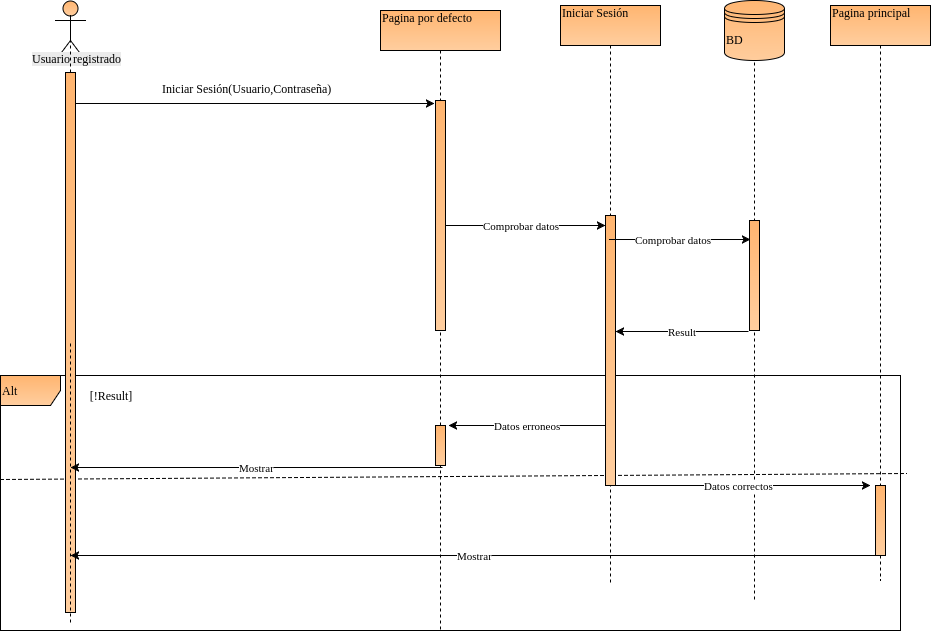
#### Guardar datos
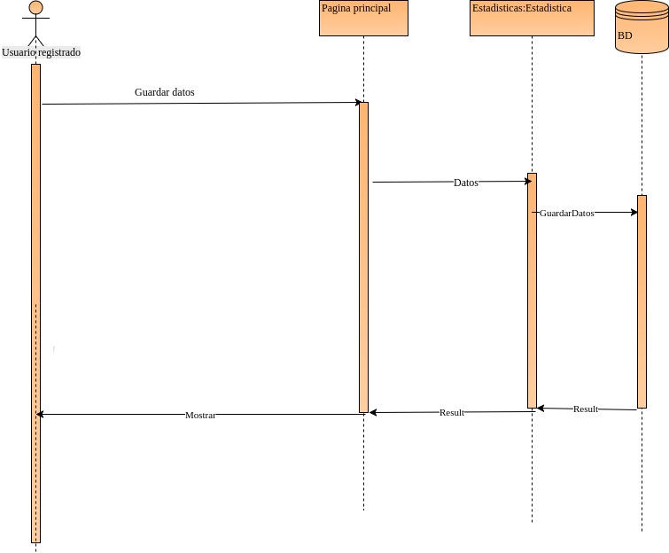
#### Ver estadisticas
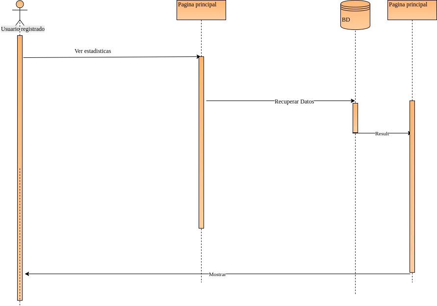
#### Cerrar Sesión
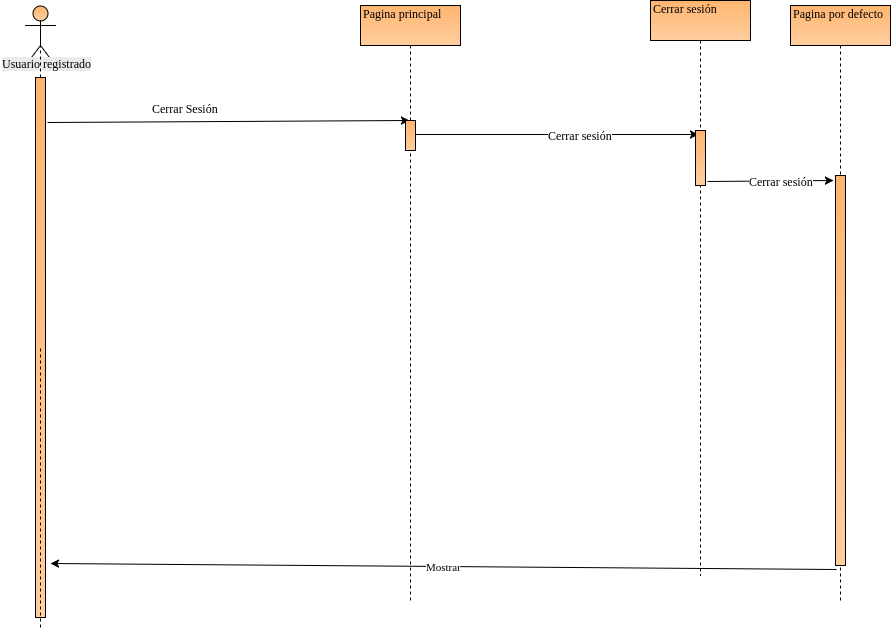
### Diagrama de clases del diseño
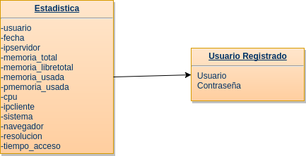

## Importamos el contenedor que exportamos
~~~
sudo docker import ApacheTrabajo.tar
~~~

## lo buscamos entre las imagenes
~~~
sudo docker images
~~~

~~~
REPOSITORY                TAG                 IMAGE ID            CREATED             SIZE
<none>					<none>				ce51d2645415		3 seconds ago		302.6 MB
~~~

## Arrancamos un contenedor con la imagen importada
~~~
sudo docker run -d -p 1111:80 -p 1112:22 -p 1113:443 -p 1114:3306 -i -t --name ApacheTrabajo ce51d2645415 bash
~~~
### Creamos otro contenedor
~~~
sudo docker run -d -p 1115:80 -p 1116:22 -p 1117:443 -p 1118:3306 -i -t --name ApacheTrabajo2 ce51d2645415 bash
~~~
## Preparamos el sistema montando los dispositivos para conectarlos en RAID

Montamos nuestros dos dispositivos de almacenamiento
~~~
sudo mkdir/run/media/alvarogl/swap1
sudo mkdir/run/media/alvarogl/swap2
sudo mount /dev/sdb1 /run/media/alvarogl/swap1/
sudo mount /dev/sdb2 /run/media/alvarogl/swap2/
~~~
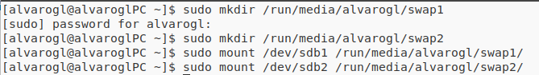
creamos, arrancamos contenedor docker y accedemos
~~~
sudo docker run --nam=apache_raid --privileged -d -p 1111:80 -p 1112:443 -p 1113:22  --device /dev/sdb1/:/dev/sdb  --device /dev/sdb1/:/dev/sdc -it 11d359dad1c2 bash
sudo docker attach apache_raid
~~~
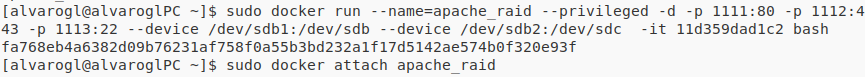

comprobamos los dispositivos de almacenamiento
~~~
fdisk -l
~~~
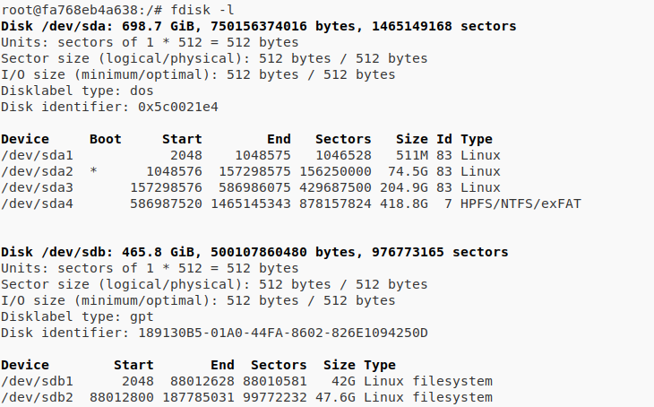
~~~
mdadm -C /dev/md0 --level=raid1 --raid-devices=2 /dev/sdb1 /dev/sdb2
mkfs /dev/md0
~~~

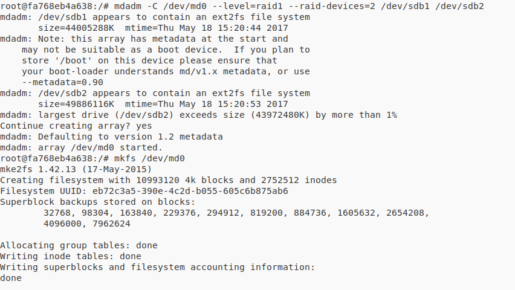

~~~
mdadm --detail /dev/md0
~~~
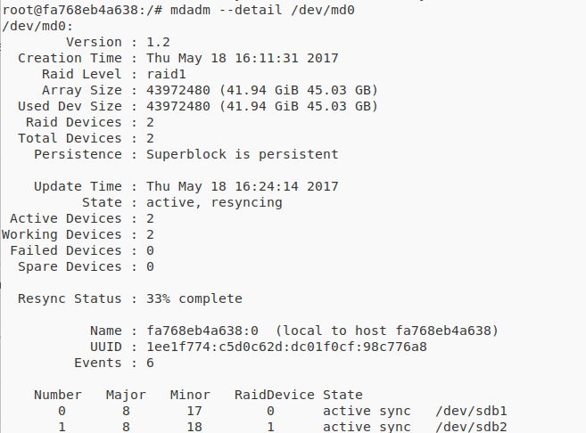

configuramos el archivo /etc/fstab

~~~
UUID=1ee1f774:c5d0c62d:dc01f0cf:98c776a8 /dat ext2 defaults 0 0
~~~
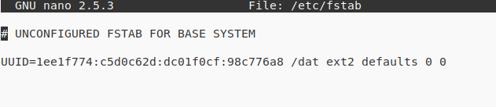

###La tabla usada
  CREATE TABLE `USER`(
  USUARIO mediumint(9) NOT NULL,
  PASS binary(16) NOT NULL
);

INSERT INTO USER VALUES('1',UNHEX(MD5('1'))); 
INSERT INTO USER VALUES('2',UNHEX(MD5('2'))); 
INSERT INTO USER VALUES('3',UNHEX(MD5('3'))); 
INSERT INTO USER VALUES('4',UNHEX(MD5('4'))); 
INSERT INTO USER VALUES('5',UNHEX(MD5('5'))); 
INSERT INTO USER VALUES('6',UNHEX(MD5('6'))); 
INSERT INTO USER VALUES('7',UNHEX(MD5('7'))); 
INSERT INTO USER VALUES('8',UNHEX(MD5('8'))); 
INSERT INTO USER VALUES('9',UNHEX(MD5('9'))); 
INSERT INTO USER VALUES('10',UNHEX(MD5('10'))); 
INSERT INTO USER VALUES('11',UNHEX(MD5('11'))); 
INSERT INTO USER VALUES('12',UNHEX(MD5('12'))); 
INSERT INTO USER VALUES('13',UNHEX(MD5('13'))); 
....

CREATE TABLE DATOS(
  USUARIO mediumint(9) NOT NULL,
  fecha DATETIME NOT NULL,
  IPServidor varchar(16) NOT NULL,
  MemTotal varchar(16) NOT NULL,
  MenPLibre varchar(6) NOT NULL,
  MenUsada varchar(16) NOT NULL,
  MenPUsada varchar(6) NOT NULL,
  CPU varchar(6) NOT NULL,
  IPCliente varchar(16) NOT NULL,
  Sistema varchar(5) NOT NULL,
  Navegador varchar(9) NOT NULL,
  Pantalla varchar(10) NOT NULL,
  tiempo_acceso varchar(6) NOT NULL,
);

# Anécdotas

## ¡Hemos roto un router!
 En las configuraciones de prueba que hicimos en su momento en una de las veces que vamos reiniciar el balanceador HAPROXY, el router desconecta la Wifi
* Creemos que era por que se había calentado por estar colocado verticalmente cuando su forma correcta es horizontal
* El router al final sigue funcionando aunque nos diera ese pequeño susto

* Actualizaciones del sistema operativo en los días anteriores a la exposición
* Un integrante del grupo había actualizado el kernel del sistema operativo en lo dos días anteriores, en OpenSuse, y la noche anterior le había pasado un kernel panic, pero seguía funcionando con docker, pues al día siguiente no se podían ejecutar algunos comandos, y tampoco iniciar los contenedores de docker que se tenían ya que daba un error:
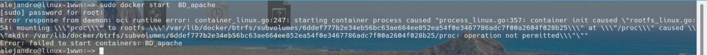
esto ocurre en la hora de prácticas y decidimos que cuando llegásemos a casa intentar solucionarlo de alguna forma.

* Estando haciendo pruebas y más intentando tener otras opciones por si fallan los principales ordenadores, Un compañero que acaba de hacer un examen llegaba a probar las confguraciones por si fallase algo, prueba arrancar Docker en su máquina con Antergos y se encuentra con errores tambien
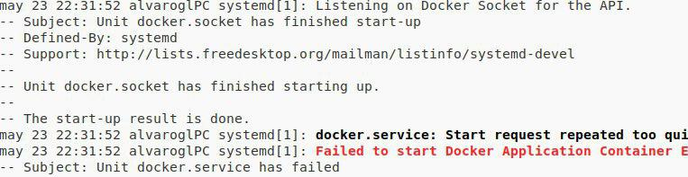
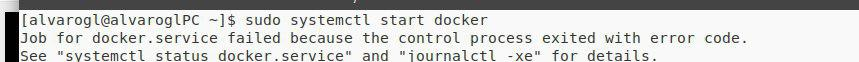
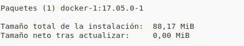
* Después de un rato se consiguen solucionar con una actualización y un reinicio del sistema

* Mientras que mis compañeros preguntan en el grupo de Telegram de Docker ES por si alguno de sus miembros le ha ocurrido para poder dar solución a esos errores, empiezo a crear copias de seguridad por sí, ocurriese algo, que no fue así

* Parece que con la gente del grupo de Telegram Docker ES consiguen ayudar a mi compañero y una propuesta es que copie las carpetas que contienen los contenedores de la carpeta /var/lib/docker
~~~
du -sh /var/lib/docker
~~~
* Desinstala Docker completo aunque el paso más importante fue borrar el subvolumen del btrfs que parecia que es lo que estaba acaparando todo
~~~
btrfs subvolume delete /var/lib/docker/btrfs/subvolumes/*
~~~

* Intenta copiar la carpeta de vuelta a Docker de nuevo instalado y se queda sin espacio en disco 

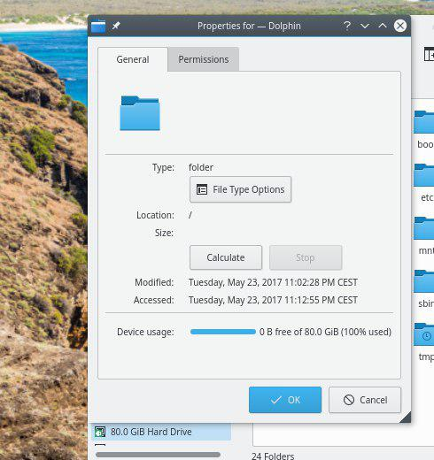

* Intentos de copiar archivos desde terminal

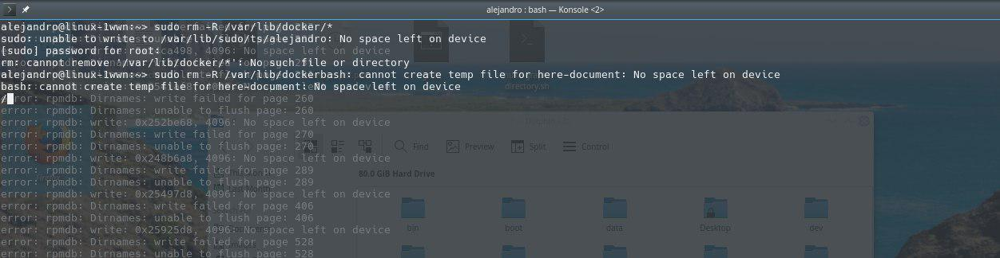

* Al final consigue hacer hueco en el disco duro y arrancar los contenedores de Docker.

___
***
- - -
1. [IBM-Docker](https://www.docker.com/ibm)
2. [Qué es Docker - Red hat](https://www.redhat.com/es/containers/what-is-docker)
3. [Google-Docker](https://cloud.google.com/container-engine/)
4. [Amazon Web services -Docker](https://aws.amazon.com/es/docker/)
5. [Empresas que utilizan Docker](https://www.docker.com/customers)
6. [AWS -Netflix](https://aws.amazon.com/es/solutions/case-studies/netflix/)
7. [Securing Containers the Netflix Way](https://speakerdeck.com/bdpayne/securing-containers-the-netflix-way)
8. [Netflix and containers not a stranger thing](https://es.slideshare.net/aspyker/netflix-and-containers-not-a-stranger-thing)
9. [Deploying Docker Containers with Netflix Spinnaker on Kubernetes and Titus](https://www.youtube.com/watch?v=ySdqDGfEOHo)
10. [AWS-Docker](https://aws.amazon.com/es/getting-started/tutorials/deploy-docker-containers/)
11. [AWS-Docker-EC2 Container Service](https://aws.amazon.com/es/ecs/)
12. [Spinnaker](http://www.spinnaker.io/docs/frequently-asked-questions)
13. [HPE-Docker](http://h22168.www2.hpe.com/us/en/partners/docker/)
