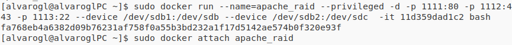

## Importamos el contenedor que exportamos
~~~
sudo docker import ApacheTrabajo.tar
~~~

## lo buscamos entre las imagenes
~~~
sudo docker images
~~~

~~~
REPOSITORY                TAG                 IMAGE ID            CREATED             SIZE
<none>					<none>				ce51d2645415		3 seconds ago		302.6 MB
~~~

## Arrancamos un contenedor con la imagen importada
~~~
sudo docker run -d -p 1111:80 -p 1112:22 -p 1113:443 -p 1114:3306 -i -t --name ApacheTrabajo ce51d2645415 bash
~~~
### Creamos otro contenedor
~~~
sudo docker run -d -p 1115:80 -p 1116:22 -p 1117:443 -p 1118:3306 -i -t --name ApacheTrabajo2 ce51d2645415 bash
~~~
## Preparamos el sistema montando los dispositivos para conectarlos en RAID

Montamos nuestros dos dispositivos de almacenamiento
~~~
sudo mkdir/run/media/alvarogl/swap1
sudo mkdir/run/media/alvarogl/swap2
sudo mount /dev/sdb1 /run/media/alvarogl/swap1/
sudo mount /dev/sdb2 /run/media/alvarogl/swap2/
~~~

creamos, arrancamos contenedor docker y accedemos
~~~
sudo docker run --nam=apache_raid --privileged -d -p 1111:80 -p 1112:443 -p 1113:22  --device /dev/sdb1/:/dev/sdb  --device /dev/sdb1/:/dev/sdc -it 11d359dad1c2 bash
sudo docker attach apache_raid
~~~

comprobamos los dispositivos de almacenamiento
~~~
fdisk -l
~~~

~~~
mdadm -C /dev/md0 --level=raid1 --raid-devices=2 /dev/sdb1 /dev/sdb2
mkfs /dev/md0
~~~

~~~
mdadm --detail /dev/md0
~~~

configuramos el archivo /etc/fstab

~~~
UUID=1ee1f774:c5d0c62d:dc01f0cf:98c776a8 /dat ext2 defaults 0 0
~~~

