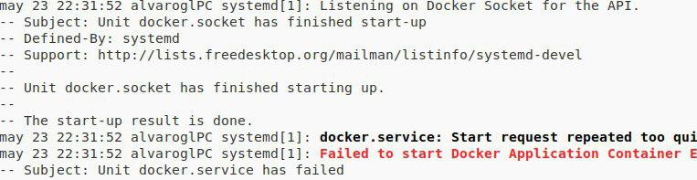

# Hemos roto un Router
* Justo antes de reiniciar de HAPROXY el router desconecta la Wifi
* Creemos que era por que se habia calentado por estar colocado verticalmente cuando su forma correcta es horizontal

# Se actualiza el sistema operativo en el último día antes de la exposición
*Compañero se había actualizado el sistema operativo de OpenSuse y la noche anterior le habia pasado un kernel panic, pero seguía funcionando, pues al día siguiente no se pueden ejecutar algunos comando, y tampoco iniciar los contenedores de docker que se tenian nos da un error, esto pasa en la hora de prácticas bueno vamos a ver si en casa intentamos solucionarlo

*estando haciendo pruebas y más intentando tener otras opciones por si fallan los principales ordenadores, se une compañero que venía de hacer un examen  prueba arrancar docker en su maquína con Antergos y se encuentra con errores tambien

*Mientras que mis compañeros preguntan en el grupo de Telegram de Docker ES por si alguno de sus miembros le ha ocurrido para poder dar solución a esos errores  rezo para que a mi no me pase , y empiezo a crear copias de seguridad por si, ocurriese algo, crucemos los dedos sin dejar de teclear

*Despues de un rato los errores del segundo compañero se consiguen solucionar con una actulización y un reboot

* Parece que con la gente del grupo de Telegram Docker ES consiguén ayudar a mi compañero y una propuesta es que copia las carpetas que contienen los contenedores 
en la carpeta /var/lib/docker
~~~
du -sh /var/lib/docker
~~~
desinstala docker completo aunque el paso más importante fue borrar el subvolumen del btrfs que parecia que es lo que estaba acaparando todo
~~~
btrfs subvolume delete /var/lib/docker/btrfs/subvolumes/*
~~~
intenta copiar la carpeta de vuelta a docker de nuevo instalado y:

Se queda sin espacio en disco 

intentos de copiar archivos desde terminal

